> **بِسْمِ اللَّهِ الرَّحْمَٰنِ الرَّحِيمِ**
> *Dengan nama Allah Yang Maha Pengasih, Maha Penyayang*

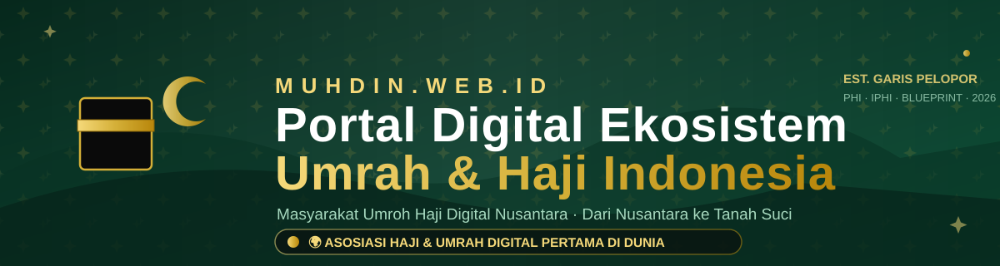

# 🕋 MUHDIN

### **MU**asyarakat **U**mroh **H**aji **D**igital **N**usantara

*Portal Digital Ekosistem Umrah & Haji Indonesia — Dari Nusantara ke Tanah Suci*
*The Digital Home for Indonesia's Umrah & Hajj Ecosystem — From the Archipelago to the Holy Land*
*المنصة الرقمية لمنظومة العمرة والحج الإندونيسية — من الأرخبيل إلى الأرض المقدسة*

[](https://nextjs.org)
[](https://react.dev)
[](https://typescriptlang.org)
[](https://tailwindcss.com)
[](https://prisma.io)
[](#opsi-1-vercel)
[](#opsi-2-php-shared-hosting)
[](#internasionalisasi)
[](#keamanan-dan-rbac)
[](#tema-gelap-dan-pwa)

**MUHDIN v3.1.0** — satu codebase, **tiga rumah deploy**: Vercel (3 klik), shared hosting PHP murni (tanpa Node.js), dan server Node.js sendiri.

> 🚀 **Buru-buru?** Push repo ini ke GitHub → buka [vercel.com/new](https://vercel.com/new) → **Import → Deploy**. Selesai — database ikut ter-bundle otomatis, data demo langsung tampil. Panduan lengkap di [Deployment](#deployment).

---

## 📑 Isi

| 🧭 Ingin… | 📄 Menuju |
|---|---|
| Memahami MUHDIN dalam sekejap | [MUHDIN dalam 30 Detik](#muhdin-dalam-30-detik) |
| Menjalankan proyek | [Jalankan Lokal](#jalankan-lokal) · [Deployment](#deployment) |
| Melihat aplikasinya duluan | [Galeri Tampilan](#galeri-tampilan) · [Tur 60 Detik](#tur-60-detik) |
| Memahami identitas & klaim | [Empat Pilar Identitas](#empat-pilar-identitas) · [Warisan dan Garis Waktu](#warisan-dan-garis-waktu) |
| Mengintegrasikan / konsumsi API | [API](#api) · [Model Data](#model-data) |
| Memeriksa keamanan | [Keamanan dan RBAC](#keamanan-dan-rbac) |
| Menerjemahkan / menambah bahasa | [Internasionalisasi](#internasionalisasi) · [Glosarium](#glosarium) |
| Memecahkan masalah | [Troubleshooting](#troubleshooting) · [FAQ](#faq) |

> Dokumen ini ditulis **100% Markdown murni** — tanpa satu pun tag HTML — sehingga terbaca rapi di mana saja: GitHub, VS Code, dashboard Vercel, aplikasi HP, bahkan editor teks paling polos. Dan setiap angka di dalamnya **diukur langsung dari kode & database (audit 2026-09-21)** — bukan angan-angan.

---

## 🕋 MUHDIN dalam 30 Detik

**MUHDIN** adalah **asosiasi haji & umrah digital pertama di dunia** — super-aplikasi yang menyatukan seluruh ekosistem penyelenggaraan ibadah umrah & haji Indonesia dalam satu platform:

- 🏛️ **Portal publik** — direktori penyelenggara terverifikasi, 13 ekosistem layanan, berita, tutorial, agenda, galeri, pelacakan jamaah, pendaftaran ber-tiket
- 🔐 **CMS Portal Mitra** — 22 modul, RBAC 4 peran, verifikasi anggota, audit log penuh
- 🛫 **Jaringan maskapai global** — 76 maskapai dari 45 negara, logo resmi self-hosted
- 🕌 **Nusuk Hub** — jembatan digital ke platform resmi Kementerian Haji Arab Saudi
- 🌍 **3 bahasa aktif** — Indonesia, English, العربية dengan RTL sungguhan
- 📱 **PWA** — bisa dipasang & tahan offline

Semua data hidup di **satu file SQLite** dengan **26 model Prisma**, dilayani **63 endpoint API**, dan bisa dijalankan di mana saja — dari laptop sampai shared hosting termurah sekalipun.

---

## 🌍 Empat Pilar Identitas

MUHDIN bukan aplikasi yang muncul dari kehampaan. Ia berdiri di atas **empat pilar** yang menyatakan siapa kami — semuanya tertanam di produk (badge hero, halaman Tentang, i18n tiga bahasa), bukan sekadar di dokumen:

**1️⃣ Asosiasi Haji & Umrah Digital Pertama di Dunia 🌍**
*"The World's First Digital Hajj & Umrah Association" — أول جمعية رقمية للحج والعمرة في العالم.* Bukan sekadar slogan: kombinasi lengkapnya belum pernah ada — asosiasi nasional yang mengelola **platform digital end-to-end** (portal publik + CMS + verifikasi penyelenggara), terintegrasi **Nusuk**, berbahasa **3 bahasa termasuk RTL Arab**.

**2️⃣ Pewaris Garis Pelopor PHI & IPHI 🏛️**
**PHI — Perjalanan Haji Indonesia** dan **IPHI — Ikatan Persaudaraan Haji Indonesia** adalah penyelenggara haji & umrah **pertama di Nusantara — jauh sebelum Kementerian Agama RI berdiri (1946)**. Kami bukan pendatang; kami pewaris garis pelopor.

**3️⃣ Pengurus Pusat Tokoh Nasional & Internasional 👥**
Pengurus Pusat MUHDIN adalah tokoh nasional dan internasional yang berpengaruh di bidang haji & umrah — termasuk para arsitek blueprint penyelenggaraan ibadah. Bukan sekadar pengurus; mereka **penulis sejarah yang masih menulis**.

**4️⃣ Blueprint Karya Abadi, Pra-Payung Hukum 🧭**
**Blueprint penyelenggaraan haji & umrah Indonesia** adalah karya abadi para tokoh itu — ditulis **sebelum ada payung hukum**. Kini arsitek yang sama duduk di Pengurus Pusat MUHDIN, dan blueprint itu menjadi fondasi platform digital ini.

---

## 🏛️ Warisan dan Garis Waktu

> ### *"Kami bukan pendatang. Kami pewaris garis pelopor."*

**Sebelum Kementerian Agama RI berdiri (1946)**, jamaah Nusantara telah dibimbing ke Tanah Suci oleh para pelopor: **PHI — Perjalanan Haji Indonesia** dan **IPHI — Ikatan Persaudaraan Haji Indonesia**. Di tangan tokoh-tokoh itulah **blueprint penyelenggaraan haji & umrah Indonesia** ditulis — karya abadi yang lahir **sebelum ada payung hukum**. Kini para arsitek yang sama duduk di **Pengurus Pusat MUHDIN**, dan garis pelopor itu menorehkan babak barunya: **asosiasi haji & umrah digital pertama di dunia**.

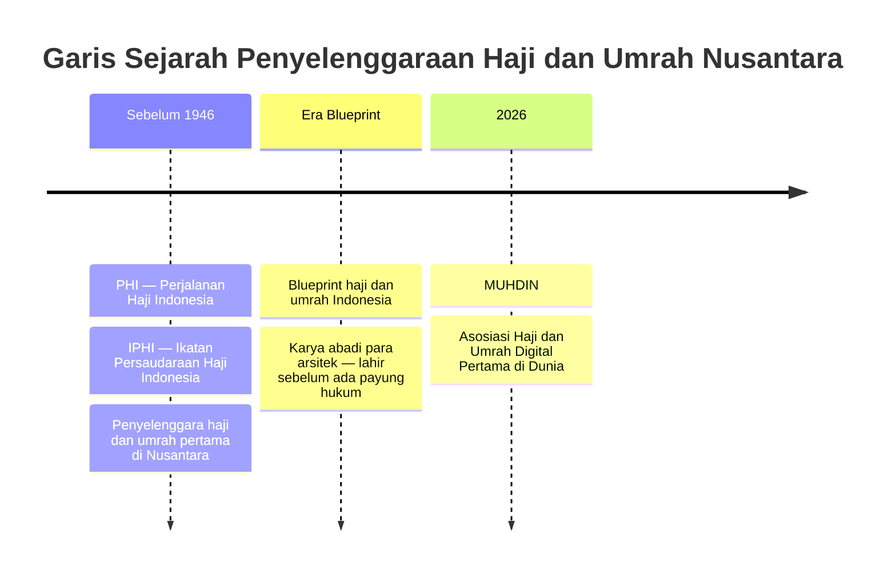

| 📜 **Era Pelopor** | 🧭 **Era Blueprint** | 🌍 **Era Digital** |
|:---|:---|:---|
| **PHI & IPHI** — penyelenggara haji & umrah pertama di Nusantara, jauh sebelum Kemenag RI (1946) | **Blueprint haji & umrah Indonesia** — karya abadi para tokoh, ditulis sebelum ada payung hukum | **MUHDIN** — asosiasi haji & umrah digital pertama di dunia; warisan tradisi, wajah teknologi |

**Susunan inti Pengurus Pusat** (tampil di `#/tentang`):

| Nama | Jabatan |
|---|---|
| **Prof. Dr. Anwar Sanusi** | Pembina |
| **KH. Qosim Saleh, Lc., M.Si.** | Penasehat |
| **Drs. Arif Racman Hakim** | Ketua Umum |
| **Gugun Gunara** | Sekretaris Jenderal |
| **Jonaedi, M.Pd.** | BEMDUM |

---

## 📸 Galeri Tampilan

> Semua tangkapan layar **asli dari aplikasi berjalan** — bukan mockup.

| | |
|:---:|:---:|
| 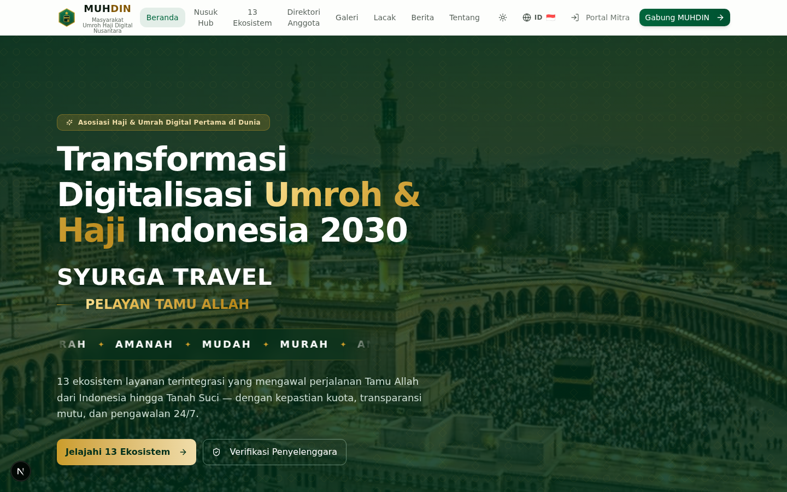 | 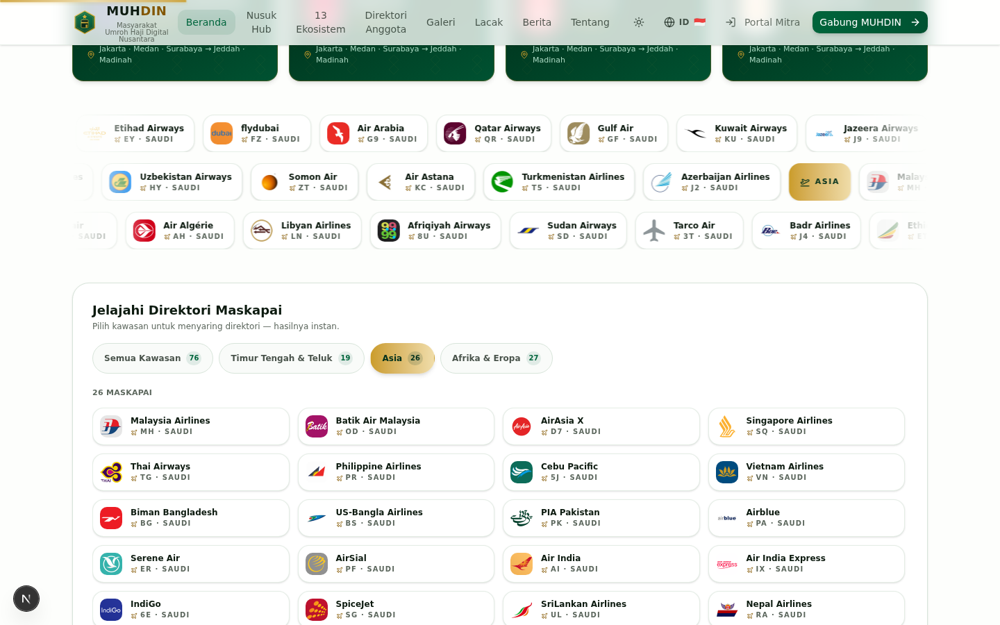 |
| **🏠 Beranda** — hero sinematik + badge first-in-world | **🛫 Direktori Maskapai** — filter kawasan Asia |
|  | 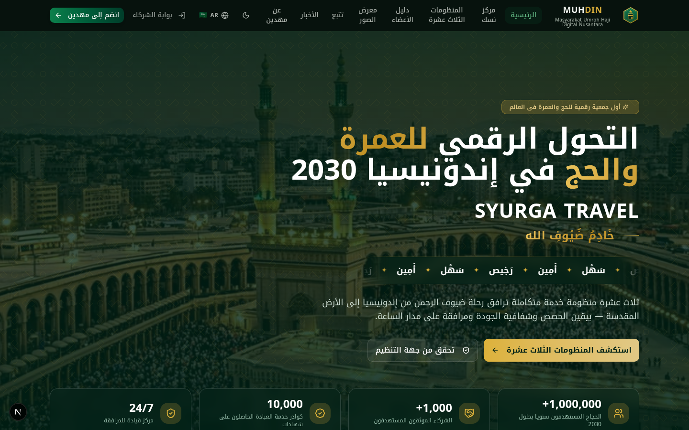 |
| **🌙 Dark Mode** — premium forest & gold | **العربية** — terjemahan sungguhan + RTL penuh |
| 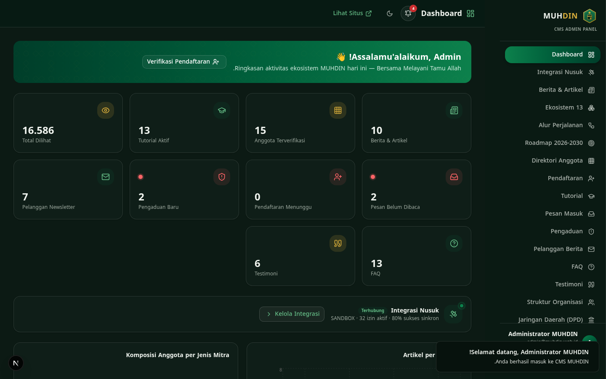 | |
| **🔐 CMS Portal Mitra** — dashboard realtime, 22 modul, audit log | |

---

## 🌟 Mengapa MUHDIN Ada?

Jutaan jamaah Indonesia berangkat setiap tahun — namun ekosistemnya masih terfragmentasi: data travel tersebar di PDF, verifikasi lisensi manual, dan jamaah sering tak tahu operatornya legal atau tidak.

| 😩 **Masalah Nyata** | ✅ **Solusi MUHDIN** |
|---|---|
| Data penyelenggara tersebar di PDF & spreadsheet statis | 📚 **Direktori anggota live** — filter instan per tipe/provinsi/kota + verifikasi lisensi publik |
| Jamaah sulit memastikan PPIU/PIHK legal | 🛡️ **Halaman verifikasi lisensi** per anggota — nomor izin, status, rating |
| Tidak ada jembatan ke sistem Nusuk Saudi | 🕌 **Nusuk Hub** — koneksi API, katalog izin, sinkronisasi, webhook, metrics |
| Konten & pengumuman tak terorganisir | ✍️ **CMS lengkap** — berita, tutorial, agenda, galeri, FAQ |
| Komunikasi satu arah, tak teraudit | 📜 **Audit log penuh** — setiap aksi admin terekam |
| Bahasa jadi penghalang jamaah mancanegara | 🌍 **3 bahasa aktif** dengan RTL sungguhan |
| Akses dari perangkat lawas & sinyal lemah | 📱 **PWA offline-ready** + hash routing super-ringan |
| Hosting mahal & rumit | 🐘 **Edisi PHP tanpa Node.js** — cukup cPanel biasa, atau **Vercel 3 klik** |

> *"Syurga bagi pengusaha pelayan Tamu Allah dan kenyamanan jamaah dalam ibadah."*

---

## 📊 MUHDIN dalam Angka

> ✅ **Diaudit 2026-09-21** — setiap angka dihitung langsung dari kode, database, dan paket build.

| | | |
|:---:|:---:|:---:|
| 💻 **27.681** baris TypeScript | 🧩 **195** file TS/TSX · **88** komponen | 🛫 **76** maskapai · **45** negara |
| 🔌 **63** endpoint API Node | 🐘 **6.188** baris PHP (paritas 1:1) | 🗃️ **26** model Prisma |
| 🌍 **888** kunci i18n × 3 = **2.664** string | 👥 **4** peran RBAC · **22** modul CMS | 🌐 **3** bahasa · RTL sungguhan |
| 📦 Paket hosting PHP **±3,2 MB** | 🧱 **16** rute hash + 404 kustom | 🍪 **1** cookie sesi untuk dua mesin |

**Isi database seed** (jalankan `bun prisma/seed.ts`): 3 akun demo · 15 anggota contoh (PPIU 5 · PIHK 4 · KBIHU 3 · Travel Wisata 2 · IPHI 1) · 13 ekosistem · 13 langkah alur jamaah · 4 fase roadmap · 13 tutorial · 10 artikel · 13 FAQ · 6 testimoni · 5 pengurus inti · galeri, agenda, unduhan, dan pengaturan situs lengkap.

---

## 👤 Untuk Siapa?

| 🧑‍🤝‍🧑 Siapa | Apa yang ia dapat |
|---|---|
| 🕋 **Jamaah** | Cari & verifikasi penyelenggara legal, lacak rombongan, baca panduan — dalam 3 bahasa, offline-ready |
| 🏢 **Penyelenggara (PPIU/PIHK/KBIHU/TW/IPHI)** | Profil terverifikasi publik, pendaftaran online ber-tiket `MHD-XXXXXX`, CMS untuk kelola konten |
| 🏛️ **Pengurus & Regulator** | Dashboard realtime, verifikasi keanggotaan berjenjang, audit log penuh |
| 👨‍💻 **Pengembang** | 63 endpoint terdokumentasi, skema Prisma bersih, dua mesin (Node/PHP) kontrak identik |
| 🌍 **Umat global** | Antarmuka Arab RTL sungguhan + English — bukan mesin cetak tempel |

---

## 🎬 Tur 60 Detik

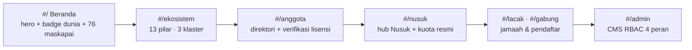

1. **Beranda** `#/` — badge *"Asosiasi Haji & Umrah Digital Pertama di Dunia"*, hero sinematik, marquee 76 maskapai dunia.
2. **Direktori** `#/anggota` — filter tipe/provinsi/kota + pencarian instan; klik profil → verifikasi lisensi publik.
3. **Nusuk Hub** `#/nusuk` — status koneksi, 6 pilar layanan resmi, kuota haji Indonesia, verifikasi izin jamaah.
4. **Layanan** `#/lacak` (kode lisensi), `#/gabung` (pendaftaran ber-tiket), `#/lapor` (pengaduan), `#/unduhan` (dokumen).
5. **CMS** `#/admin` — login sesuai peran → dashboard, 22 modul, audit log.

---

## 📖 Tentang

Satu platform yang menggabungkan **empat zona** dalam satu codebase:

| Zona | Rute | Isi |
|---|---|---|
| 🏛️ **Portal Publik** | `#/` | 13 ekosistem, direktori anggota, berita, tutorial, agenda, galeri, pelacakan, pendaftaran |
| 🔐 **CMS Portal Mitra** | `#/admin` | 22 modul: konten, verifikasi, Nusuk, audit log, pengguna |
| 🛫 **Jaringan Maskapai** | beranda | 76 maskapai dunia dari 45 negara — logo resmi, filter kawasan |
| 🕌 **Nusuk Hub** | `#/nusuk` | Tasreeh, Raudah, Mashaer, Hawiya — jembatan ke Kementerian Haji Saudi |

**Nilai inti** — tertanam di UI dan di kode:

| Nilai | Artinya di kode |
|---|---|
| 🤲 **Amanah** | tata kelola teraudit (`AuditLog` untuk setiap aksi) |
| 🎓 **Profesional** | prosedur baku + mutu berkala (guard seragam, validasi) |
| 🔗 **Terintegrasi** | satu data & satu alur (26 model, satu DB, dua mesin API identik) |
| 👁️ **Transparan** | status & rekam jejak terbuka publik (verifikasi lisensi) |
| 🛡️ **Tepercaya** | legalitas diverifikasi, sanksi konsisten (RBAC 4 peran) |

**Dokumen sumber konsep**: seluruh narasi portal (13 ekosistem, lima mitra
utama, enam pilar teknologi, lima nilai, model bisnis akad syariah, peta jalan
2026-2030, KPI) bersumber dari **Whitepaper MUHDIN Edisi 1.0 — September 2026**
("Arsitektur 13 Ekosistem Layanan Umroh-Haji Terintegrasi"). Dokumen asli bisa
diunduh publik di halaman `#/unduhan` (berkas: `public/dokumen/whitepaper-muhdin-2026.pdf`)
dan menjadi acuan penulisan konten (lihat `CONTENT_GUIDE.md` §8).

---

## 🚀 Jalankan Lokal

> **Prasyarat**: [Bun](https://bun.sh) ≥ 1.1 (atau Node ≥ 20) — **tanpa konfigurasi manual**, `.env` sudah otomatis.

```bash
# 1️⃣ Clone & masuk
git clone <repo> muhdin && cd muhdin

# 2️⃣ Install dependensi
bun install

# 3️⃣ Siapkan database SQLite
bun run db:push

# 4️⃣ Isi data awal (akun demo, ekosistem, anggota, artikel, maskapai, …)
bun prisma/seed.ts

# 5️⃣ (Opsional) Pasang susunan pengurus resmi MUHDIN
bun scripts/update-management.mjs

# 6️⃣ Jalankan
bun run dev          # → http://localhost:3000
```

### 🔑 Kredensial Demo CMS (`#/admin`)

| Peran | Email | Password |
|---|---|---|
| **Super Admin** | `admin@muhdin.web.id` | `muhdin2026` |
| **Verifikator** | `verifikator@muhdin.web.id` | `verifikator2026` |
| **Editor** | `editor@muhdin.web.id` | `editor2026` |

> 🔐 Node menyimpan hash **scrypt** (`salt:hash`); edisi PHP memakai **bcrypt** — pipeline `hosting:build` otomatis me-rehash akun demo, sehingga kredensial yang sama bekerja di kedua mesin. Tidak pernah ada plaintext di database.

> ⚠️ Jika tampilan basi atau hydration mismatch → `pkill -f "next dev"; rm -rf .next; bun run dev` (lihat [Troubleshooting](#troubleshooting)).

---

## 📦 Deployment

MUHDIN bisa hidup di **empat macam rumah** — pilih yang paling nyaman. Untuk kamu yang ingin jalan paling cepat: **Vercel, tiga klik, selesai**.

### ⭐ Opsi 1 Vercel

Cara modern tanpa ribet — **didukung penuh sejak v3.1.0**, nol konfigurasi:

1. Push repo ini ke **GitHub** (atau GitLab/Bitbucket).
2. Buka [vercel.com/new](https://vercel.com/new) → **Import** repo-nya.
3. Klik **Deploy** — selesai. ⚠️ **Tidak perlu** mengatur environment variable apa pun.

Atau lewat CLI dari folder proyek:

```bash
npm i -g vercel
vercel            # deploy preview
vercel --prod     # deploy produksi
```

**Kenapa bisa jalan tanpa disetel apa pun?** Semua otomatis sejak v3.1.0:

| 🏗️ Saat build | ⚡ Saat runtime |
|---|---|
| `postinstall` + `build` menjalankan `prisma generate` → Prisma Client selalu ter-generate | `src/lib/db.ts` mendeteksi lingkungan Vercel, menyalin `db/custom.db` yang ter-bundle ke `/tmp` (satu-satunya folder writable), lalu mengarahkan Prisma ke sana |
| `next.config.ts` melewati mode `standalone` — Vercel punya packaging sendiri | `DATABASE_URL` warisan yang menunjuk file yang tidak ada **diabaikan dengan anggun** (self-healing) |
| `outputFileTracingIncludes` membawa Prisma Query Engine (multi-platform) **dan file database** ke dalam fungsi serverless | Log query Prisma otomatis senyap di produksi |

> 💡 **Catatan jujur soal data**: filesystem Vercel bersifat *ephemeral* — setiap deploy baru / instance dingin mendapat salinan database segar dari repo. Untuk **portal publik, demo, preview, dan staging: sempurna** (login CMS demo pun langsung bekerja). Untuk **data yang harus permanen** (pendaftaran anggota harian, audit log), gunakan [Opsi 2](#opsi-2-php-shared-hosting), [Opsi 3](#opsi-3-nodejs-cpanel), atau [Opsi 4](#opsi-4-vps) — di sana database menetap di disk yang persisten.

### 🐘 Opsi 2 PHP Shared Hosting

**Paling revolusioner**: MUHDIN berjalan penuh — portal + CMS + Nusuk Hub + verifikasi + audit — di shared hosting cPanel biasa **tanpa Node.js, tanpa MySQL, tanpa SSH, tanpa Composer**:

```bash
bun run hosting:build     # → deploy/muhdin-shared-hosting/ + zip ±3,2 MB
```

Pipeline otomatis: salinan proyek terisolasi di `/tmp` → `next build` dengan `BUILD_STATIC=1` (static export) → rakit paket: frontend statis + backend **PHP murni** (8 berkas, 6.188 baris — replika 1:1 seluruh 63 endpoint Node) + `muhdin.sqlite` + `.htaccess` + `INSTALL.txt` → re-hash akun demo ke bcrypt → zip siap unggah.

**Cara pasang (±5 menit)**: unggah zip ke `public_html` → **Extract** → selesai. Verifikasi `https://domain-anda/api/health` → `{"ok":true,...}`. Lalu **ganti password akun demo** (wajib).

Prasyaratnya satu: **PHP 7.4+ dengan `pdo_sqlite`** (bawaan semua cPanel). Panduan lengkap: `PANDUAN-SHARED-HOSTING.md` dan `INSTALL.txt` dalam paket.

### 🟡 Opsi 3 Node.js cPanel

Untuk fitur **AI inline translation** penuh di shared hosting yang menyediakan Setup Node.js App:

```bash
bun run build            # build standalone + post-build
bun run hosting:pack     # → release/muhdin-shared-hosting.zip (±90 MB)
```

Upload zip → Extract → **Setup Node.js App**: Node 20+, Application root = folder hasil extract, **Startup file = `server.js`** → Restart. ✅ *Tanpa* `npm install` (semua sudah ter-bundle + dual Prisma engine Debian/RHEL).

### 🟣 Opsi 4 VPS

```bash
bun install && bun run db:push && bun prisma/seed.ts
bun run build && bun run start   # atau jalankan .next/standalone/server.js
```

### Matriks Target Deploy

| Target | Cara | Catatan |
|---|---|---|
| 🟣 **Vercel** | **Import repo → Deploy (3 klik)** | ⭐ termudah sejak v3.1.0 — otomatis penuh; cocok portal publik/demo/preview (data tulis ephemeral) |
| 🟢 cPanel shared hosting | `hosting:build` → zip ±3,2 MB → unggah & extract | termudah **tanpa Node.js** (PHP Edition) — data permanen |
| 🟡 cPanel + Node App | `hosting:pack` → zip → Setup Node App | AI inline translation penuh — data permanen |
| 🟣 VPS (Ubuntu/Debian/RHEL) | build + `standalone/server.js` atau systemd | penuh — data permanen |
| 🔵 Railway / Fly.io / Render | deploy repo + `bun run build` | tambahkan volume untuk `db/custom.db` |

---

## 🧱 Arsitektur Sistem

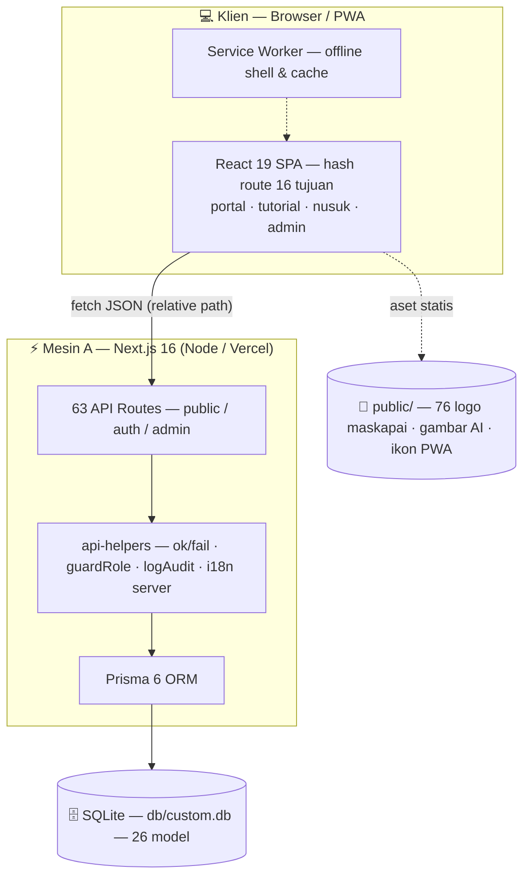

**Dan mesin keduanya — edisi shared hosting tanpa Node.js:**

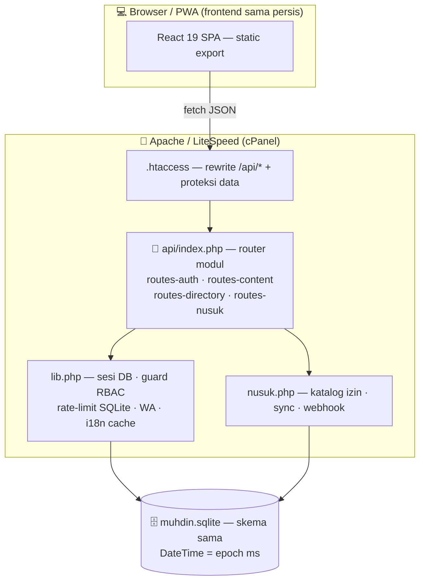

**Keputusan arsitektur (mengapa begini):**

1. **Satu `app/page.tsx` + hash router kustom** (`useSyncExternalStore`) — SPA murni melayani 16 rute tanpa konfigurasi rewrite server. Berjalan di cPanel, Nginx, Apache, Vercel, bahkan static host.
2. **API layer seragam** — setiap endpoint melewati `ok()`/`fail()`, guard peran RBAC server-side, `logAudit()`, dan `applyEntityTranslations()`. Kedua mesin (Node & PHP) mengikuti kontrak yang sama persis — teks error pun identik.
3. **Aset maskapai self-hosted** — logo diunduh, divalidasi magic-bytes, disimpan lokal → aman untuk produksi, cepat, tanpa hotlink CDN.
4. **SQLite + Prisma** — zero-config, satu file mudah dibackup, 100% kompatibel shared hosting & Vercel. Butuh skala besar? Ganti `provider` di schema → `db:push`.
5. **Tri-mode build** — `BUILD_STATIC=1` → static export untuk edisi PHP; `VERCEL=1` (otomatis) → packaging serverless Vercel; default → `standalone` Node dengan fitur AI penuh. Tiga paket deploy dari satu codebase.
6. **Prisma 6 menyimpan DateTime sebagai INTEGER epoch-ms** — backend PHP menulis & menormalkan format yang sama, sehingga **database yang sama bisa dibaca-tulis kedua mesin** (terverifikasi uji silang).

---

## 🔄 Alur Penting

### 🔑 Autentikasi (login → sesi)

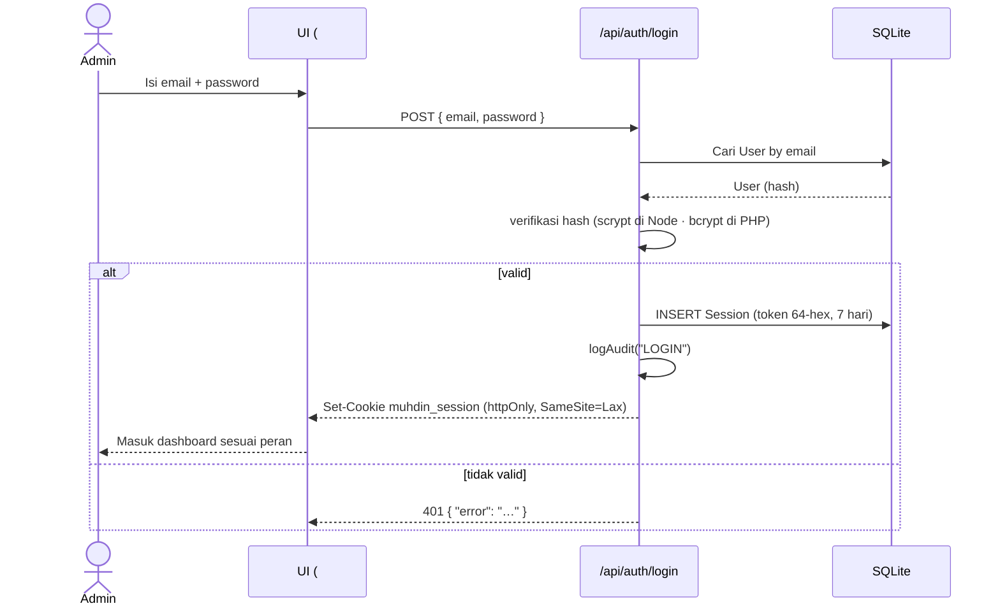

> 🛡️ Rate limit login: 5 percobaan / menit — percobaan ke-6 mendapat **429** dengan pesan yang sama di kedua mesin.

### ✅ Verifikasi Anggota (pendaftaran → terverifikasi)

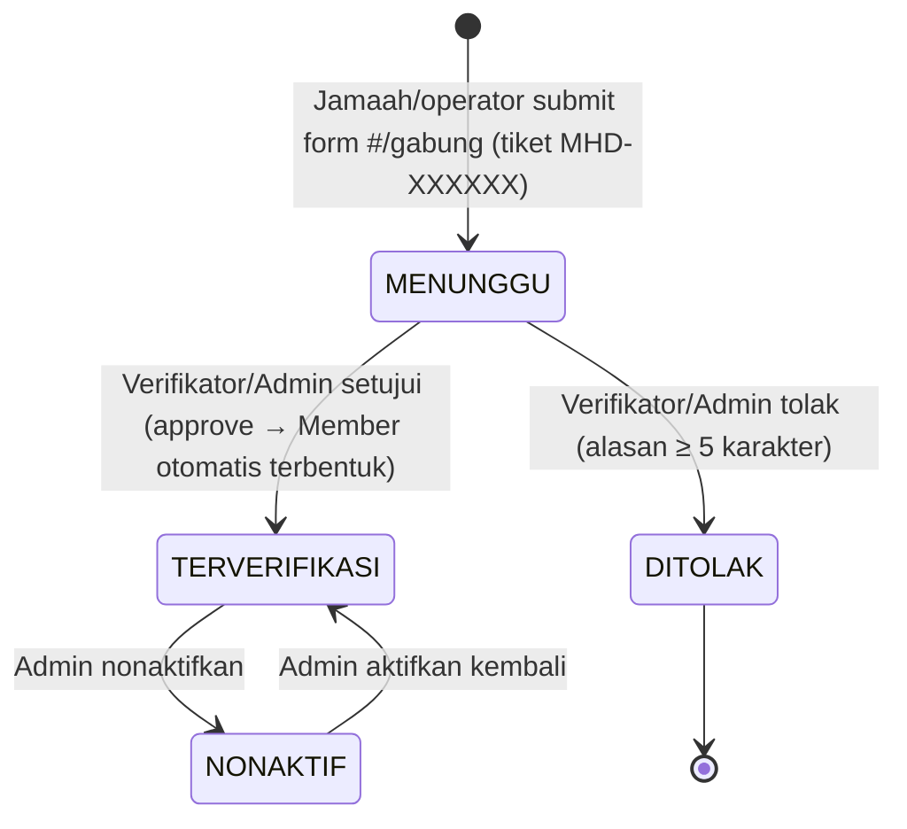

Setiap transisi tercatat di `AuditLog` dengan aktor, aksi, dan timestamp. Pendaftar dapat memantau statusnya secara publik via `#/gabung` → lacak tiket.

---

## 🗃️ Model Data

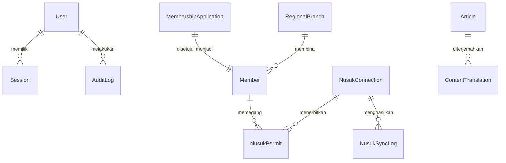

**26 model** dalam 6 kelompok fungsional:

| Kelompok | Model | Catatan |
|---|---|---|
| 🪪 **Auth & Jejak** | `User` · `Session` · `AuditLog` | 4 peran; sesi DB + cookie `muhdin_session` |
| 📰 **Konten** | `SiteSetting` · `Ecosystem` · `JourneyStep` · `Roadmap` · `Article` · `Tutorial` · `Faq` · `Testimonial` | terjemahan EN/AR via `ContentTranslation` |
| 👥 **Keanggotaan** | `Member` · `MembershipApplication` · `ContactMessage` · `Complaint` · `Subscriber` | tiket `MHD-XXXXXX`, status verifikasi |
| 🏛️ **Organisasi** | `Management` · `RegionalBranch` | susunan pengurus resmi + Bakorwil/Bakorcab |
| 🎬 **Media & Kegiatan** | `Gallery` · `Event` · `Resource` | galeri · agenda · perpustakaan unduhan |
| 🕌 **Integrasi Nusuk** | `NusukConnection` · `NusukPermit` · `NusukSyncLog` · `WhatsAppSetting` · `ContentTranslation` | mode SANDBOX/PRODUCTION + gateway WA |

Skema lengkap: [`prisma/schema.prisma`](prisma/schema.prisma) · seed idempoten: [`prisma/seed.ts`](prisma/seed.ts)

---

## ✨ Fitur

### 🏠 Portal Publik

- **Hero sinematik** — Ken Burns + parallax + marquee *MUDAH. MURAH. AMANAH.*
- **Badge First-in-World** — *"Asosiasi Haji & Umrah Digital Pertama di Dunia"* (3 bahasa)
- **Warisan Sejarah** — garis PHI & IPHI → blueprint → era digital (3 bahasa)
- **13 Ekosistem** — 3 klaster: Akses & Mobilitas, Pengalaman Ibadah, Nilai Tambah & Mutu
- **Alur 13 Tahap** — zero-gap handover dari pendaftaran hingga pasca-ibadah
- **Direktori anggota** — filter tipe/provinsi/kota + pencarian instan + profil `#/anggota/:slug` dengan verifikasi lisensi publik
- **Berita & Tutorial** — kategori, level, markdown-lite renderer, views counter
- **Lacak Jamaah** — pantau status rombongan via kode lisensi (`?code=`)
- **Agenda, Galeri, Unduhan, FAQ, Kontak, Lapor, Pendaftaran Anggota ber-tiket**

### 🛫 Jaringan Maskapai Global

- **76 maskapai dunia dari 45 negara** dengan logo resmi (2 CDN fallback, validasi magic-bytes, cache lokal)
- **Direktori filter interaktif** — chip kawasan ber-counter → grid hasil instan + animasi stagger
- 3 baris **marquee** arah berselang + hover-pause
- **4 kartu unggulan Indonesia** — Garuda · Batik · Lion · Sriwijaya

### 🔐 CMS — Portal Mitra (22 modul)

- **RBAC 4 peran**: `SUPER_ADMIN` · `ADMIN` · `VERIFIKATOR` · `EDITOR` — dieksekusi server-side, bukan cuma UI
- **CRUD 13+ entitas** — artikel, tutorial, FAQ, testimoni, anggota, agenda, galeri, cabang, dsb. (termasuk terjemahan EN/AR per baris)
- **Verifikasi Anggota** — setujui/tolak pendaftaran ber-tiket, aktif/nonaktif — semua tercatat di audit log
- **Struktur Organisasi resmi** — bagan Pengurus Pusat → Penunjukan → Bakorwil → Bakorcab
- **Panel Nusuk** — koneksi SANDBOX/PRODUCTION, rotasi kunci, sinkronisasi, izin jamaah, log, webhook
- **Pengguna & Audit** — kelola akun admin (hanya SUPER_ADMIN), jejak audit penuh
- **WhatsApp & Translator** — 3 gateway WA (Fonnte/Wablas/Custom) + penerjemah konten EN/AR
- **Dashboard** — statistik live dari `/api/stats`

### 🌐 Teknologi & Pengalaman

- **i18n 3 bahasa aktif** — Indonesia 🇮🇩 · English 🇬🇧 · العربية 🇸🇦 dengan RTL penuh & font Arab (888 kunci × 3 = 2.664 string)
- **Dark mode** premium (next-themes, tanpa flash saat load)
- **PWA** — installable, halaman offline, service worker cache shell
- **Animasi McKinsey-grade** — framer-motion, scroll-reveal, CountUp, stagger — menghormati `prefers-reduced-motion`
- **Desain Spectrum 8** — palet forest & gold dengan pola islami

---

## 🔌 API

Semua respons JSON seragam — sukses: objek/array, gagal: `{ "error": "pesan" }` dengan status HTTP tepat. Konten multibahasa mengikuti query `?locale=en|ar`. **63 berkas route** di `src/app/api/**` — dan seluruhnya direplikasi **1:1 di backend PHP** edisi hosting.

**Publik — tanpa login:**

| Endpoint | Keterangan |
|---|---|
| `GET /api/health` | Health check (status DB + runtime) |
| `GET /api/settings` | Map key→nilai situs (otomatis terjemahan) |
| `GET /api/ecosystems` · `/api/journey` · `/api/roadmap` | Ekosistem (13) · alur (13) · roadmap (4) |
| `GET /api/articles?limit=&category=` · `GET /api/articles/slug/:slug` | Berita (+views counter) |
| `GET /api/tutorials` · `GET /api/tutorials/slug/:slug` | Tutorial |
| `GET /api/faqs` · `GET /api/testimonials` | FAQ & testimoni |
| `GET /api/members?type=&province=&city=&q=` · `GET /api/members/:slug` | Direktori + verifikasi lisensi |
| `GET /api/branches` · `GET /api/management` | Bakorwil & susunan pengurus |
| `GET /api/gallery` · `GET /api/events` · `GET /api/resources` | Galeri · agenda · unduhan |
| `GET /api/applications/track?ticket=` | Lacak pendaftaran (publik, terbatas) |
| `GET /api/search?q=` | Pencarian lintas entitas |
| `GET /api/rss` | Feed RSS 2.0 artikel |
| `GET /api/nusuk/public` | Status integrasi Nusuk + metrics |
| `GET /api/nusuk/verify?no=` | Verifikasi izin jamaah |
| `POST /api/applications` | Pendaftaran anggota → tiket `MHD-XXXXXX` + WA |
| `POST /api/messages` | Pesan kontak → WA |
| `POST /api/complaints` | Pengaduan → WA |
| `POST /api/subscribers` | Langganan buletin (`already:true` bila duplikat) |
| `POST /api/testimonials` | Kirim testimoni (`published=false`) |

**Auth — cookie `muhdin_session` (httpOnly, 7 hari):**

| Endpoint | Keterangan |
|---|---|
| `POST /api/auth/login` | `{email, password}` → cookie sesi + audit LOGIN (rate limit 5/menit) |
| `GET /api/auth/me` | User aktif + peran, atau `{user:null}` |
| `POST /api/auth/logout` | Hapus sesi + audit LOGOUT |
| `PUT /api/auth/password` | Ganti password + cabut sesi lain |

**Admin — guard RBAC + audit otomatis:**

| Endpoint | Guard | Keterangan |
|---|---|---|
| `GET /api/stats` | sesi | Angka dashboard realtime |
| `GET/POST /api/:entity` · `GET/PUT/DELETE /api/:entity/:id` | per-entity | CRUD: `articles` · `tutorials` · `faqs` · `testimonials` · `ecosystems` · `journey` · `roadmap` · `gallery` · `events` · `resources` · `management` · `branches` · `members` · `applications` · `messages` · `complaints` · `subscribers` |
| `POST /api/members/verify` | verifikasi | Setujui/tolak anggota |
| `PUT /api/applications/:id` | verifikasi | Approve (→ auto-create Member) / reject |
| `GET/PUT /api/settings` | admin | Pengaturan situs + terjemahan |
| `GET/POST /api/translations` | admin | Status & mulai terjemahan konten |
| `GET /api/audit` | SUPER_ADMIN | Jejak audit |
| `GET/POST /api/users` · `PUT/DELETE /api/users/:id` | SUPER_ADMIN | Kelola akun admin |
| `GET /api/export?dataset=` | admin | Ekspor CSV dengan BOM |
| `GET/PUT /api/whatsapp` · `POST /api/whatsapp/test` | admin | Gateway WA 3 provider + uji koneksi |
| `GET/PUT/DELETE /api/nusuk/connection` · `POST /api/nusuk/rotate` | admin | Koneksi Nusuk + rotasi kunci |
| `GET /api/nusuk/permits` · `GET /api/nusuk/logs` · `POST /api/nusuk/sync` | admin | Izin · log · sinkronisasi |
| `POST /api/nusuk/webhook` | publik (signature) | Callback event Nusuk (HMAC/secret) |

**Contoh nyata:**

```bash
# Cari PPIU di Jawa Barat
curl "http://localhost:3000/api/members?type=PPIU&province=Jawa%20Barat"

# Health check edisi PHP (shared hosting)
curl "https://domain-anda/api/health"
# → {"ok":true,"service":"muhdin.web.id","checks":{"database":{"ok":true,…}}}
```

---

## 🌍 Internasionalisasi

**Tiga bahasa aktif di seluruh situs** — portal, tutorial, Nusuk, dan CMS.

```
src/lib/i18n/
├── index.tsx          → LocaleProvider + useT() + formatNumber/DateL10n + dir RTL
└── locales/           → 20 file namespace × 3 bahasa (about, home, members, …)
```

| Aspek | Detail |
|---|---|
| **Pemakaian** | `const { t, locale } = useT(); t("home.hero.title1")` — fallback aman ke key |
| **Paritas key** | ✅ **888 key identik 1:1 di id/en/ar** (= 2.664 string) |
| **Interpolasi** | `t("portal.x", { n: 5 })` → placeholder `{n}` diganti |
| **Persistensi** | Cookie `muhdin-locale` — pilihan bahasa diingat antar-kunjungan |
| **Server-side** | `localeFromRequest(req)` + `applyEntityTranslations()` + tabel `ContentTranslation` |
| **RTL** | `<html dir="rtl">` via provider · ikon pakai class `icon-flip` · layout `start/end` · font Arab via `next/font` |
| **Angka & tanggal** | `formatNumber`/`DateL10n` mengikuti locale aktif |

**Menambah bahasa baru (mis. Melayu, Mandarin):** (1) tambahkan blok bahasa di `src/lib/i18n/locales/*.ts`, (2) daftarkan kodenya di `LocaleProvider` — set `dir: "rtl"` bila perlu. Selesai — switcher navbar otomatis menampilkan opsi baru.

---

## 🛫 Jaringan Maskapai Global

Data & logo dikelola lewat satu pipeline:

```bash
bun scripts/fetch-airline-logos.mjs   # unduh logo + generate src/lib/airlines.ts
```

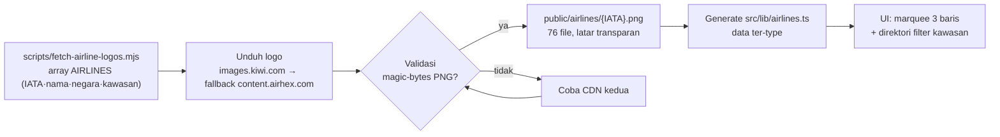

- **76 maskapai / 45 negara / 3 kawasan** + 4 kartu unggulan Indonesia
- **Self-hosted** — tanpa hotlink, aman shared hosting & bandwidth
- Tambah maskapai? Edit array `AIRLINES` di `scripts/fetch-airline-logos.mjs` → jalankan ulang. Selesai.

---

## 🔐 Keamanan dan RBAC

**Hierarki peran** (semakin besar level, semakin luas kewenangan):

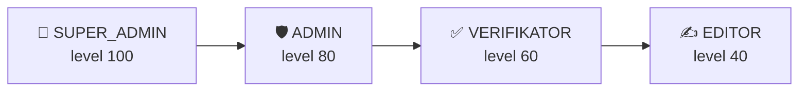

**Matriks modul CMS** (dari `src/lib/roles.ts` — dieksekusi server-side):

| Modul | SUPER_ADMIN | ADMIN | VERIFIKATOR | EDITOR |
|---|:---:|:---:|:---:|:---:|
| Dashboard | ✅ | ✅ | ✅ | ✅ |
| Nusuk · Pesan · Subscriber · Pengaturan | ✅ | ✅ | — | — |
| Artikel · Ekosistem · Alur · Roadmap · Tutorial · FAQ · Testimoni · Pengurus · Cabang · Galeri · Agenda · Unduhan · Translator | ✅ | ✅ | — | ✅ |
| Anggota · Pendaftaran · Pengaduan | ✅ | ✅ | ✅ | — |
| Audit Log · Kelola Pengguna | ✅ | — | — | — |

**Lapisan keamanan bawaan:**

- 🔐 Password **scrypt** (Node) / **bcrypt** (PHP) — tidak ada plaintext di database
- 🍪 Session cookie **httpOnly + SameSite=Lax** (kedaluwarsa 7 hari, token 64-hex acak) — nama cookie sama di kedua mesin
- 🛡️ **RBAC server-side** di seluruh endpoint admin — UI hanya lapisan kenyamanan
- 🚦 **Rate limit** — login 5/menit (Node in-memory · PHP tabel SQLite) → 429
- 📜 **Audit log otomatis** — LOGIN · LOGOUT · CREATE · UPDATE · DELETE · VERIFY · SYNC · EXPORT
- 🧬 Query **parameterized** — Prisma di Node, prepared statement PDO di PHP — bebas SQL injection
- ✍️ **Webhook Nusuk terverifikasi tanda tangan** (secret/HMAC, `hash_equals`)
- 🚫 `.htaccess` memblokir unduhan `.sqlite` & dotfiles di edisi hosting

```ts
// Contoh guard di route.ts (pola nyata proyek ini):
await requireSession(req);                    // 401 bila tanpa sesi
await guardRole(req, ["SUPER_ADMIN", "ADMIN"]); // 403 bila peran tak berizin
await logAudit(req, "VERIFY", "Member", id);  // jejak otomatis
```

---

## 🎨 Design System Spectrum 8

Palet identitas di `globals.css` (Tailwind 4 `@theme`):

| Token | Peran |
|---|---|
| `forest` / `forest-deep` | Primer — hijau zamrud khas ibadah |
| `gold` / `gold-soft` / `gold-deep` | Aksen kemewahan & kaligrafi |
| `mint` | Latar section selang-seling |
| `emerald` · `teal` · `amber` · `olive` · `sage` · `bronze` | Spektrum 8 pendukung (chart, badge, level) |

**Utilitas khas**: `text-gold-gradient` · `gold-divider` · `glass` · `bg-islamic-pattern-gold` · `animate-marquee(-reverse)` · `animate-ken-burns` · `animate-float-soft`.

**Aksesibilitas**: semua animasi menghormati `prefers-reduced-motion` · target sentuh ≥ 44px · kontras WCAG pada kedua tema · semantik `main/header/nav/section` + ARIA · navigasi keyboard penuh.

---

## 🌓 Tema Gelap dan PWA

| Aspek | Detail |
|---|---|
| **Dark mode** | next-themes, class-based, tanpa flash-of-wrong-theme; palet forest-gold khusus gelap |
| **Manifest** | `public/manifest.webmanifest` — nama, tema `#0b3d2c`, ikon 192/512 + maskable |
| **Service worker** | `public/sw.js` — cache shell, halaman offline; nonaktif otomatis di mode dev (anti hydration mismatch), auto-update di produksi |
| **Installable** | Chrome/Edge/Safari → "Install app" → ikon home, tampilan standalone |

---

## 📜 Skrip

| Perintah | Fungsi |
|---|---|
| `bun run dev` | Dev server (Turbopack) di port 3000 |
| `bun run build` | `prisma generate` → build produksi → `post-build.mjs` (juga dipakai Vercel otomatis) |
| `bun run start` | Server produksi (`.next/standalone/server.js`) |
| `bun run lint` | ESLint (flat config, `next/core-web-vitals`) — gerbang mutu 0 error |
| `bun run db:push` | Sinkron schema Prisma → SQLite |
| `bun run db:generate` / `db:migrate` / `db:reset` | Utility Prisma lainnya |
| `bun prisma/seed.ts` | Seed data lengkap (idempoten — aman dijalankan berulang) |
| `bun scripts/translate-content.mts` | Terjemahkan konten DB (EN/AR) |
| `bun scripts/fetch-airline-logos.mjs` | Unduh logo maskapai + generate `src/lib/airlines.ts` |
| `bun scripts/update-management.mjs` | Pasang susunan pengurus resmi (idempoten) |
| `bun scripts/contrast-audit.mjs` | Audit kontras warna kedua tema |
| `bun run hosting:build` | **Build edisi shared hosting tanpa Node.js** (zip ±3,2 MB) |
| `bun run hosting:pack` | Paket deploy shared hosting Node standalone (±90 MB) |

---

## 🧭 Peta Rute

SPA berbasis **hash-route** (`src/hooks/use-hash-route.ts`) — satu `app/page.tsx`, nol konfigurasi server.

| Rute | Halaman |
|---|---|
| `#/` | 🏠 Beranda — hero + badge first-in-world + maskapai + 13 ekosistem |
| `#/nusuk` | 🕌 Nusuk Hub — status integrasi + layanan resmi + kuota |
| `#/ekosistem` | 🏛️ Detail 13 ekosistem per klaster |
| `#/alur` | 🗺️ Timeline 13 tahap perjalanan jamaah |
| `#/anggota` | 📚 Direktori anggota — filter + pencarian |
| `#/anggota/:slug` | 🪪 Profil anggota + verifikasi lisensi |
| `#/berita` · `#/berita/:slug` | 📰 Daftar & detail berita |
| `#/tutorial` · `#/tutorial/:slug` | 🎓 Daftar & detail tutorial |
| `#/galeri` | 🖼️ Galeri kegiatan |
| `#/agenda` | 📅 Agenda kegiatan |
| `#/unduhan` | 📥 Perpustakaan dokumen |
| `#/lacak` | 🔎 Lacak rombongan (`?code=LISENSI`) |
| `#/lapor` | 🚨 Pengaduan jamaah |
| `#/kontak` | 📮 Kontak sekretariat + form |
| `#/gabung` | ✍️ Pendaftaran anggota baru (tiket MHD-XXXXXX) |
| `#/tentang` | ℹ️ Visi-misi, warisan PHI & IPHI, struktur organisasi, FAQ |
| `#/admin` | 🔐 Portal Mitra (CMS) — login RBAC |
| *rute tak dikenal* | 🚧 404 custom dengan navigasi pulang |

---

## ⚡ Mutu dan Performa

**Gerbang mutu yang sudah lolos:**

| Gerbang | Status |
|---|---|
| ESLint (flat config, `next/core-web-vitals`) | ✅ 0 error |
| TypeScript strict | ✅ 0 error |
| Uji E2E Agent Browser — 3 bahasa · RTL · dark mode · mobile 390px | ✅ lolos, console bersih |
| Paritas key i18n id/en/ar | ✅ 888 kunci identik 1:1 |
| `php -l` seluruh 8 berkas PHP edisi hosting | ✅ 0 syntax error |
| E2E backend PHP (login bcrypt, CRUD, tiket→approve, webhook HMAC, rate-limit, CSV BOM, RSS) | ✅ lolos |
| Uji silang DB PHP⇄Prisma (epoch ms dua arah) | ✅ lolos |
| Konfigurasi Vercel (postinstall generate · post-build graceful · DB serverless-safe) | ✅ sejak v3.1.0 |

**Benchmark nyata** — localhost, terbaik dari 3 putaran, 2026-09-21:

| Ukuran | Node (`:3000`) | PHP Edition (`:3010`) |
|---|---:|---:|
| `GET /` (beranda) | 42,6 ms | **0,08 ms** (statik) |
| `GET /api/members` | 5,4 ms | **0,10 ms** |

```bash
# Ukur sendiri:
for i in 1 2 3; do curl -s -o /dev/null -w "%{time_total}s\n" http://localhost:3000/api/members; done
```

**Prinsip performa:** hash routing tanpa full reload · logo maskapai lokal (tanpa latensi CDN) · PWA cache shell · animasi framer-motion yang menghormati `prefers-reduced-motion`.

---

## 📚 Glosarium

| Istilah | Arti |
|---|---|
| **PPIU** | Penyelenggara Perjalanan Ibadah Umrah (biro travel umrah berizin) |
| **PIHK** | Penyelenggara Ibadah Haji Khusus |
| **KBIHU** | Konsorsium Biro Perjalanan Ibadah Haji |
| **IPHI** | Ikatan Persaudaraan Haji Indonesia |
| **PHI** | Perjalanan Haji Indonesia — pelopor penyelenggara haji Nusantara pra-1946 |
| **TW** | Travel Wisata (penyelenggara wisata halal & ziarah) |
| **Nusuk** | Platform digital resmi Kementerian Haji Arab Saudi |
| **Tasreeh** | Izin/permit jamaah dalam ekosistem Nusuk |
| **Raudah** | Area antara makam Nabi ﷺ dan mimbar Masjid Nabawi (izin khusus) |
| **Mashaer** | Rangkaian tempat ibadah haji (Mina, Arafah, Muzdalifah) |
| **Hawiya** | Sistem identitas jamaah Nusuk |
| **Bakorwil / Bakorcab** | Badan Koordinator Wilayah (provinsi) / Cabang (kab/kota) MUHDIN |
| **BEMDUM** | Bendahara Umum |
| **Tiket MHD-XXXXXX** | Kode unik pendaftaran anggota (alfanumerik 6, tanpa I/O agar tak tertukar) |
| **Spectrum 8** | Sistem desain MUHDIN: forest & gold + 6 warna pendukung |

---

## 🔧 Troubleshooting

| Gejala | Penyebab & Solusi |
|---|---|
| **Hydration mismatch / UI lama (dev)** | Bundle Turbopack basi → `pkill -f "next dev"; rm -rf .next; bun run dev` |
| **500 semua API (lokal/VPS)** | Schema berubah → `bun run db:push` lalu restart |
| **Login admin gagal** | Pastikan seed sudah jalan: `bun prisma/seed.ts` |
| **Vercel: build gagal `@prisma/client did not initialize`** | Repo belum v3.1.0 → pastikan `postinstall` & `build` menjalankan `prisma generate` (sudah otomatis di v3.1.0) |
| **Vercel: data kosong / API 500** | Pastikan `db/custom.db` ikut ter-commit (`git ls-files db/`) — sejak v3.1.0 file DB dibundel otomatis |
| **Vercel: data tulis hilang setelah deploy** | Sifat ephemeral Vercel (wajar) — untuk data permanen pakai Opsi 2/3/4 di [Deployment](#deployment) |
| **Vercel: log query penuh** | Sudah dibungkam sejak v3.1.0 — log Prisma hanya aktif di development |
| **Logo maskapai 404** | `bun scripts/fetch-airline-logos.mjs` (atau `--force`) |
| **Font Arab tidak muncul** | `next/font/google` butuh internet saat build pertama |
| **Bahasa kembali ke Indonesia** | Pilihan tersimpan di cookie `muhdin-locale` — cek cookie tidak diblokir |
| **Port 3000 terpakai** | `pkill -f "next-server"` lalu jalankan lagi |
| **Pengurus tampil data lama** | Jalankan `bun scripts/update-management.mjs` |
| **Edisi PHP: 500 / blank** | PHP ≥ 7.4 & `pdo_sqlite` aktif; pastikan `.htaccess` ikut terunggah (dotfile!) |
| **Edisi PHP: 429** | Rate limit aktif (5 percobaan/menit) — tunggu 1 menit |

---

## ❓ FAQ

**1. Benarkah MUHDIN bisa jalan di shared hosting TANPA Node.js?**

Benar. Jalankan `bun run hosting:build`, unggah zip ±3,2 MB ke `public_html`, extract — selesai. Backend API berpindah ke **PHP + PDO SQLite** dengan kontrak identik: sesi, RBAC, audit, rate-limit, WhatsApp, Nusuk Hub, ekspor CSV. Prasyaratnya satu: PHP 7.4+ dengan `pdo_sqlite`.

**2. Bagaimana cara deploy ke Vercel?**

Push ke GitHub → [vercel.com/new](https://vercel.com/new) → Import → Deploy. Sejak v3.1.0 semuanya otomatis: Prisma Client ter-generate saat install, file database ikut ter-bundle, dan runtime menyalinnya ke `/tmp`. Tidak perlu environment variable apa pun. Satu catatan: penulisan data di Vercel bersifat sementara (ephemeral) — ideal untuk portal publik, demo, dan preview; untuk data permanen gunakan shared hosting/VPS.

**3. Apakah MUHDIN bagian dari Nusuk (Kementerian Haji Saudi) atau Kemenag RI?**

Tidak. MUHDIN adalah asosiasi independen penyelenggara ibadah — pewaris garis pelopor PHI & IPHI. Integrasi Nusuk dilakukan lewat koneksi API resmi (SANDBOX/PRODUCTION) untuk melayani anggota.

**4. Apa makna PHI, IPHI, dan "blueprint karya abadi"?**

**PHI (Perjalanan Haji Indonesia)** dan **IPHI (Ikatan Persaudaraan Haji Indonesia)** adalah penyelenggara haji & umrah **pertama di Nusantara — sebelum Kementerian Agama RI berdiri (1946)**. **Blueprint haji & umrah Indonesia** adalah karya abadi para tokoh yang kini duduk di Pengurus Pusat MUHDIN — ditulis sebelum ada payung hukum. MUHDIN melanjutkan garis itu sebagai **asosiasi haji & umrah digital pertama di dunia**.

**5. Berapa banyak data anggota bawaan?**

Seed berisi **15 anggota contoh** (5 PPIU · 4 PIHK · 3 KBIHU · 2 Travel Wisata · 1 IPHI) — cukup untuk mendemokan seluruh alur. Skema & CMS siap menampung ribuan anggota; tambahkan lewat CMS.

**6. Kenapa memilih SQLite, bukan PostgreSQL/MySQL?**

Zero-config, satu file mudah dibackup, dan 100% kompatibel shared hosting maupun Vercel. Butuh skala besar? Ganti `provider` di `prisma/schema.prisma` → `bun run db:push`.

**7. Kenapa hash-route (`#/admin`), bukan path biasa?**

SPA murni tanpa rewrite server — berjalan di cPanel, Nginx, Apache, Vercel, atau static host apa pun tanpa konfigurasi tambahan. Plus navigasi instan tanpa full reload.

**8. Aplikasi bisa dipakai offline?**

Ya. Sebagai **PWA**, shell aplikasi & halaman offline tersedia via service worker — pasang lewat menu "Install app" di browser. Service worker otomatis nonaktif di mode dev dan auto-update di produksi.

**9. Berapa spesifikasi hosting minimal?**

**Edisi PHP**: shared hosting mana pun dengan PHP 7.4+ & `pdo_sqlite` (paket ±3,2 MB). **Edisi Node/Vercel**: Node.js 20+. Berjalan mulus dari cPanel entry-level sampai VPS 512 MB.

**10. Apakah data jamaah aman?**

Ya — hashing password (scrypt/bcrypt), cookie httpOnly, RBAC server-side, audit log penuh, query parameterized, webhook terverifikasi tanda tangan, dan rate limit.

---

## 🎯 Roadmap 2030

| Fase | Fokus | Status |
|---|---|---|
| 🧱 **2026** | Fondasi & kepercayaan — platform v3 + deploy universal (Vercel · PHP · Node) | ✅ berjalan |
| 🔗 **2027** | Integrasi Nusuk produksi + aplikasi jamaah publik | 🔜 |
| 🌏 **2028-29** | Bakorwil 34 provinsi + Bakorcab kab/kota + ekonomi syariah ibadah | 🔜 |
| 🕋 **2030** | 1.000.000 jamaah/tahun + ekspor layanan digital | 🎯 |

---

## 📅 Riwayat Versi

| Versi | Tanggal | Sorotan |
|---|---|---|
| **3.1.0** | 2026-09-21 | 🟣 **VERCEL-READY + READABILITY** — dukungan deploy Vercel penuh: `prisma generate` otomatis (postinstall+build) · `next.config` tri-mode (standalone / Vercel / static export) · `db.ts` self-healing (salin DB ter-bundle ke `/tmp`, abaikan `DATABASE_URL` warisan yang mati, log senyap di produksi) · `post-build` graceful di Vercel · file DB di-bundle via `outputFileTracingIncludes` · **README ditulis ulang 100% Markdown murni (nol HTML) — terbaca rapi di mana saja** · Deployment Vercel jadi Opsi 1 |
| **3.0.0** | 2026-09-21 | 🏆 **MAHAKARYA** — audit total angka (27.681 baris TS · 63 route · 26 model · 888 kunci i18n) · rekonstruksi penuh backend PHP (6.188 baris, paritas 1:1 63 endpoint) · README berbasis fakta terukur · 4 Pilar Identitas + Tur 60 Detik + Glosarium + matriks 22 modul · paket hosting v3.0.0 |
| **2.0.0** | 2026-09-20 | 🐘 **SHARED HOSTING EDITION — TANPA NODE.JS** — backend PHP paritas Node · static export `BUILD_STATIC=1` · zip 3,2 MB + `.htaccess` + `INSTALL.txt` · uji silang PHP⇄Prisma lolos |
| **1.4.0** | 2026-09-19 | 🌍 **Branding First-in-World** — klaim "Asosiasi Haji & Umrah Digital Pertama di Dunia" · 🏛️ Warisan PHI & IPHI (pra-1946) · 🧭 Blueprint karya abadi · 👥 Susunan pengurus resmi |
| **1.3.0** | 2026-09-19 | 📖 Diagram Mermaid (arsitektur · ER · auth · verifikasi · pipeline maskapai), matriks RBAC, contoh API nyata |
| **1.2.0** | 2026-09-18 | 📚 Import entri direktori riil (PPIU · PIHK · asosiasi) · filter provinsi · tipe ASOSIASI |
| **1.1.0** | 2026-09-18 | 🛫 Filter maskapai per kawasan (chip ber-counter + grid direktori) |
| **1.0.0** | 2026-09-17 | 🚀 Peluncuran: portal 4 zona · CMS RBAC 4 peran · Nusuk Hub · i18n 3 bahasa + RTL · PWA · dark mode |

---

## 🤝 Kontribusi

Kami menyambut kontribusi! Alur kerjanya:

1. **Fork & branch** dari `main` — penamaan `feat/…`, `fix/…`, `docs/…`
2. **Standar kode**: TypeScript strict · ESLint 0 error (`bun run lint`) · shadcn/ui untuk komponen baru
3. **Sebelum push**: `bun run lint` bersih, halaman terkait dites manual (3 bahasa + dark mode + mobile)
4. **PR** — jelaskan masalah & solusi; sertakan tangkapan layar untuk perubahan visual
5. **i18n**: setiap string UI wajib lewat `t()` — tidak boleh hardcode; tambahkan key di ketiga bahasa
6. **API**: perubahan kontrak endpoint Node **wajib disinkronkan ke backend PHP** (`shared-hosting/api`) — dua mesin, satu kontrak

---

## 🙏 Kredit dan Penghargaan

**Developer by** — **PT Digital Bisnis Manajemen (Digiman)**
**Support System** — **JuraganWeb**

*Warisan organisasi*: garis pelopor **PHI — Perjalanan Haji Indonesia** & **IPHI — Ikatan Persaudaraan Haji Indonesia**, penyelenggara haji & umrah pertama di Nusantara.
*Gambar hero & section*: AI-generated, khusus untuk MUHDIN.

### ⚖️ Disclaimer

- MUHDIN **bukan** bagian dari Kementerian Haji Saudi (Nusuk) maupun Kemenag RI.
- Logo maskapai adalah merek dagang masing-masing pemilik, ditampilkan untuk keperluan informasi.
- Status verifikasi anggota menunjukkan pemeriksaan internal MUHDIN atas legalitas izin yang dilampirkan pendaftar.

---

## 📄 Lisensi

Projek proprietary — © 2026 **MUHDIN — Masyarakat Umroh Haji Digital Nusantara** · **muhdin.web.id** 🕋

Penggunaan komersial, redistribusi, dan modifikasi memerlukan izin tertulis dari pemilik hak. Kontak: **sekretariat@muhdin.web.id**

---

*Dibangun dengan 💚 untuk pelayanan Tamu Allah — dari Nusantara, untuk umat.*

**بِسْمِ اللَّهِ تَوَكَّلْنَا** · *Innal umrah wal hajju lillah*
