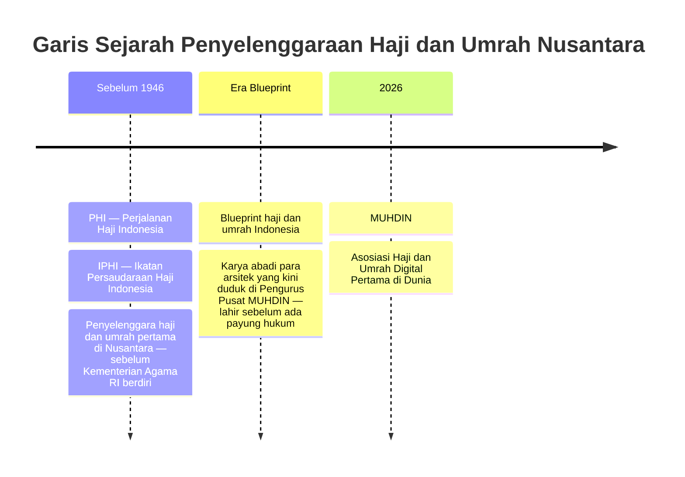
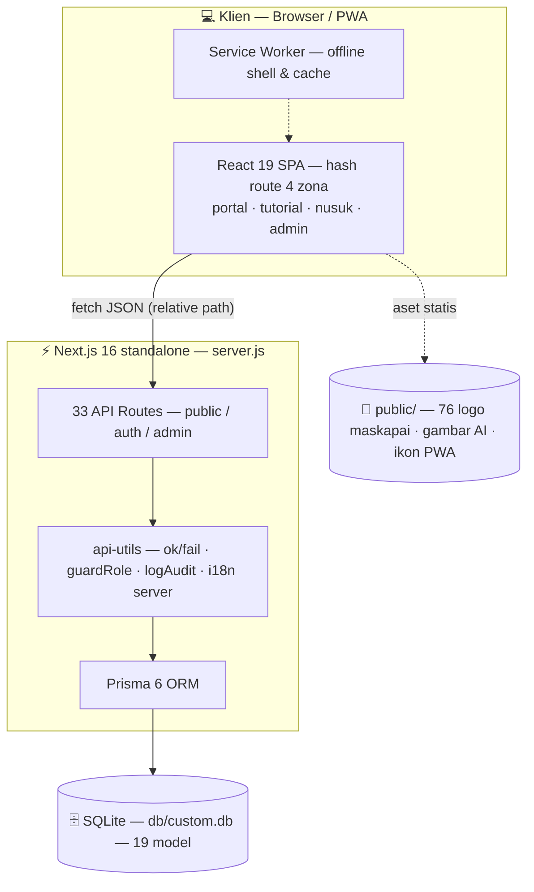
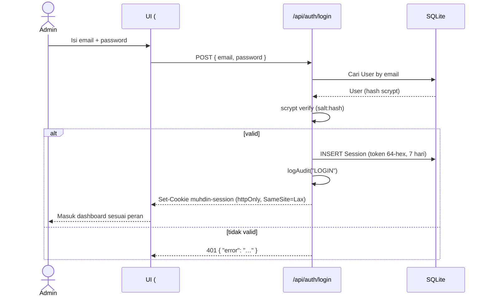
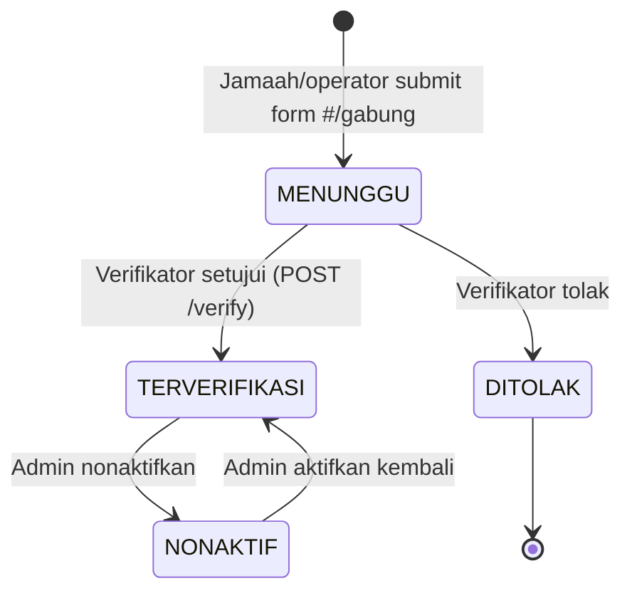
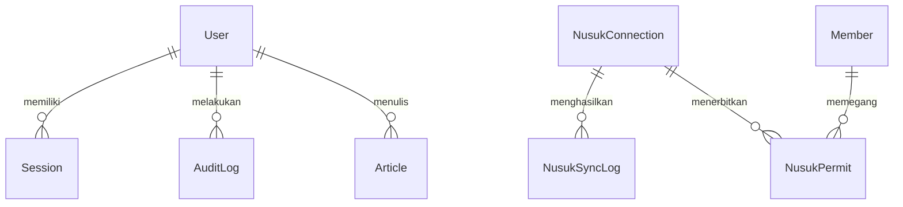
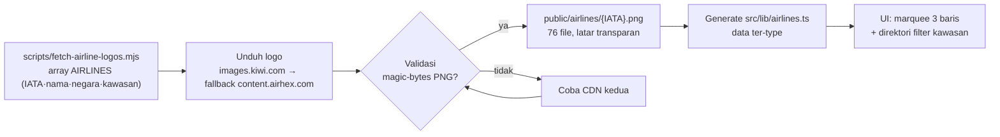
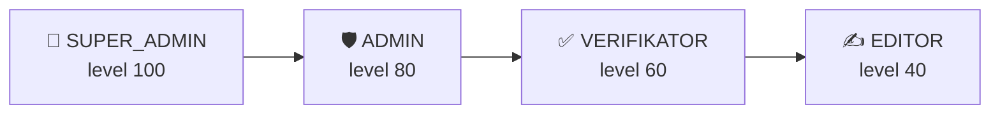

<p align="center"><b>بِسْمِ اللَّهِ الرَّحْمَٰنِ الرَّحِيمِ</b><br><sub>Dengan nama Allah Yang Maha Pengasih, Maha Penyayang</sub></p>

<div align="center">
  

# 🕋 MUHDIN

### **MU**asyarakat **U**mroh **H**aji **D**igital **N**usantara

*Portal Digital Ekosistem Umrah & Haji Indonesia — Dari Nusantara ke Tanah Suci*
*The Digital Home for Indonesia's Umrah & Hajj Ecosystem — From the Archipelago to the Holy Land*
*المنصة الرقمية لمنظومة العمرة والحج الإندونيسية — من الأرخبيل إلى الأرض المقدسة*

## 🌍 Asosiasi Haji & Umrah Digital **Pertama di Dunia**

*The World's First Digital Hajj & Umrah Association* · *أول جمعية رقمية للحج والعمرة في العالم*

[](https://nextjs.org)
[](https://react.dev)
[](https://typescriptlang.org)
[](https://tailwindcss.com)
[](https://prisma.io)
[](https://sqlite.org)
[](https://bun.sh)
[](https://developer.mozilla.org/docs/Web/Progressive_web_apps)
[](https://motion.dev)
[](#-internasionalisasi)
[](#-warisan-dan-garis-waktu)
[](#-keamanan-dan-kontrol-akses-rbac)
[](#-muhdin-dalam-angka)
[](#-mutu-dan-performa)
[](#-deployment)
[](#-lisensi)

**[📸 Galeri](#-galeri-tampilan)** ·
**[🏛️ Warisan](#-warisan-dan-garis-waktu)** ·
**[🌟 Mengapa](#-mengapa-muhdin-ada)** ·
**[📊 Angka](#-muhdin-dalam-angka)** ·
**[📖 Tentang](#-tentang)** ·
**[🧱 Arsitektur](#-arsitektur-sistem)** ·
**[🔄 Alur](#-alur-penting)** ·
**[🗃️ Data](#-model-data--database)** ·
**[✨ Fitur](#-fitur)** ·
**[🚀 Mulai](#-mulai-cepat)** ·
**[📜 Skrip](#-skrip)** ·
**[🧭 Rute](#-peta-rute)** ·
**[🔌 API](#-api)** ·
**[🌍 i18n](#-internasionalisasi)** ·
**[🛫 Maskapai](#-jaringan-maskapai-global)** ·
**[🔐 RBAC](#-keamanan-dan-kontrol-akses-rbac)** ·
**[🎨 Desain](#-design-system-spectrum-8)** ·
**[🌓 Tema](#-tema-gelap--pwa)** ·
**[📦 Deploy](#-deployment)** ·
**[⚡ Mutu](#-mutu-dan-performa)** ·
**[🔧 Troubleshoot](#-troubleshooting)** ·
**[❓ FAQ](#-faq)** ·
**[🎯 Roadmap](#-roadmap-muhdin-2030)** ·
**[📅 Versi](#-riwayat-versi)** ·
**[🤝 Kontribusi](#-kontribusi)** ·
**[🙏 Kredit](#-kredit--penghargaan)** ·
**[📄 Lisensi](#-lisensi)**

</div>

---

## 📸 Galeri Tampilan

> Semua tangkapan layar di bawah ini **asli dari aplikasi berjalan** — bukan mockup. Lihat sendiri di [Mulai Cepat](#-mulai-cepat).

<div align="center">

<table>
  <tr>
    <td width="50%" align="center">
      
      <br><sub><b>🏠 Beranda</b> — hero sinematik Ken Burns + parallax + marquee <i>MUDAH · MURAH · AMANAH</i></sub>
    </td>
    <td width="50%" align="center">
      
      <br><sub><b>🛫 Direktori Maskapai</b> — filter kawasan Asia, grid hasil instan + counter</sub>
    </td>
  </tr>
  <tr>
    <td width="50%" align="center">
      
      <br><sub><b>🌙 Dark Mode</b> — premium forest &amp; gold, kontras terjaga</sub>
    </td>
    <td width="50%" align="center">
      
      <br><sub><b>العربية</b> — terjemahan sungguhan + tata letak RTL penuh (bukan cermin palsu)</sub>
    </td>
  </tr>
</table>


<sub><b>🔐 CMS Portal Mitra</b> — dashboard realtime, CRUD 13 entitas, verifikasi anggota, panel Nusuk, audit log</sub>

</div>

---

## 🏛️ Warisan dan Garis Waktu

<div align="center">

> ### *"Kami bukan pendatang. Kami pewaris garis pelopor."*

</div>

**Sebelum Kementerian Agama RI berdiri (1946)**, jamaah Nusantara telah dibimbing ke Tanah Suci oleh para pelopor: **PHI — Perjalanan Haji Indonesia** dan **IPHI — Ikatan Persaudaraan Haji Indonesia**, penyelenggara haji & umrah **pertama di Nusantara**. Di tangan tokoh-tokoh itulah **blueprint penyelenggaraan haji & umrah Indonesia** ditulis — karya abadi yang lahir **sebelum ada payung hukum**. Kini para arsitek yang sama duduk di **Pengurus Pusat MUHDIN**, dan garis pelopor itu menorehkan babak barunya: **asosiasi haji & umrah digital pertama di dunia**.



| 📜 **Era Pelopor** | 🧭 **Era Blueprint** | 🌍 **Era Digital** |
|:---|:---|:---|
| **PHI & IPHI** — penyelenggara haji & umrah pertama di Nusantara, jauh sebelum Kemenag RI (1946) | **Blueprint haji & umrah Indonesia** — karya abadi para tokoh yang kini duduk di Pengurus Pusat MUHDIN, ditulis sebelum ada payung hukum | **MUHDIN** — asosiasi haji & umrah digital pertama di dunia; warisan tradisi, wajah teknologi |

**Pengurus Pusat MUHDIN** adalah tokoh nasional dan internasional yang berpengaruh di bidang haji & umrah — termasuk para arsitek blueprint di atas. Bukan sekadar pengurus; mereka adalah **penulis sejarah yang masih menulis**.

<details>
<summary><b>🌏 Mengapa klaim "pertama di dunia" ini layak dicanangkan?</b></summary>

Banyak organisasi digital. Banyak asosiasi ibadah. Tapi **kombinasi lengkap** — asosiasi nasional yang (1) menggelola platform digital end-to-end (portal publik + CMS + verifikasi 1.185 penyelenggara), (2) terintegrasi Nusuk, (3) berbahasa 3 bahasa termasuk RTL Arab, dan (4) diwarisi garis pelopor PHI & IPHI — belum ada sebelumnya. MUHDIN adalah yang pertama menggabungkan semuanya dalam satu payung.
</details>

---

## 🌟 Mengapa MUHDIN Ada?

Jutaan jamaah Indonesia berangkat setiap tahun — namun ekosistemnya masih terfragmentasi: data travel tersebar di PDF Kemenag, verifikasi lisensi manual, komunikasi via WhatsApp, dan jamaah sering tak tahu operatornya legal atau tidak.

> 🏛️ **Bukan pendatang** — MUHDIN mewarisi garis pelopor **PHI & IPHI**, penyelenggara haji & umrah pertama di Nusantara sebelum Kemenag RI, dengan **blueprint karya abadi** para pengurus pusatnya. Baca [Warisan dan Garis Waktu](#-warisan-dan-garis-waktu).

| 😩 **Masalah Nyata** | ✅ **Solusi MUHDIN** |
|---|---|
| Data 1.100+ penyelenggara tersebar di PDF & spreadsheet statis | 📚 **Perpustakaan digital live** — 1.185 entri, filter instan per tipe/provinsi/kota, pencarian real-time |
| Jamaah sulit memastikan PPIU/PIHK legal | 🛡️ **Halaman verifikasi lisensi** per anggota — nomor izin, status, rating, tampil publik |
| Tidak ada jembatan ke sistem Nusuk Saudi | 🕌 **Nusuk Hub** — koneksi API SANDBOX/PRODUCTION, Tasreeh, Raudah, Mashaer, Hawiya |
| Konten & pengumuman tak terorganisir | ✍️ **CMS lengkap** — berita, tutorial, agenda, galeri, FAQ dengan draft→publish |
| Komunikasi satu arah, tak teraudit | 📜 **Audit log penuh** — setiap aksi admin terekam (LOGIN, CREATE, VERIFY, …) |
| Bahasa jadi penghalang jamaah mancanegara | 🌍 **3 bahasa aktif** — Indonesia · English · العربية dengan RTL sungguhan |
| Akses dari perangkat lawas & sinyal lemah di Makkah | 📱 **PWA offline-ready** + hash routing super-ringan |

> *"Syurga bagi pengusaha pelayan Tamu Allah dan kenyamanan jamaah dalam ibadah."*

---

## 📊 MUHDIN dalam Angka

<div align="center">

| | | |
|:---:|:---:|:---:|
| 🧑‍💼 **1.185** anggota terdaftar | 🗺️ **26** provinsi · **152** kota | 🛫 **76** maskapai · **46** negara |
| 🏛️ **13** ekosistem · 3 klaster | 🔌 **33** API endpoint | 🗃️ **19** model Prisma |
| 🌍 **825** key i18n × 3 bahasa = **2.475** string | 💻 **15.807** baris TypeScript | 🧩 **101** file sumber · **42** komponen |
| 🎬 **14** view portal + CMS | 🏷️ **13** entitas CRUD | 👥 **4** peran RBAC |

</div>

<details>
<summary><b>🔍 Rincian 1.185 anggota per tipe (data nyata dari database)</b></summary>

| Tipe | Jumlah | Arti |
|---|---:|---|
| **PPIU** | 914 | Penyelenggara Perjalanan Ibadah Umrah (biro travel) |
| **PIHK** | 252 | Penyelenggara Ibadah Haji Khusus |
| **ASOSIASI** | 14 | Asosiasi induk — HIMPUH, IPHI, AMPHURI, ASHURI, … |
| **KBIHU** | 2 | Kantor Biro Perjalanan Ibadah HU |
| **TW** | 2 | Travel Umrah (registrasi khusus) |
| **IPHI** | 1 | Ikatan Penyelenggara Perjalanan Ibadah |
| **Total** | **1.185** | ✅ terverifikasi via panel admin |

Sumber data: riset lapangan dari publikasi Kemenag RI, HIMPUH & TiMS — diimpor via `bun scripts/import-directory.mjs` dari `research/*.json`.

</details>

---

## 📖 Tentang

**MUHDIN** adalah **asosiasi haji & umrah digital pertama di dunia** — super-aplikasi portal untuk ekosistem penyelenggaraan ibadah umrah & haji Indonesia, mewarisi garis pelopor [PHI & IPHI](#-warisan-dan-garis-waktu). Satu platform yang menggabungkan **empat pilar**:

| Pilar | Zona | Isi |
|---|---|---|
| 🏛️ **Portal Publik** | `#/` | Etalase 13 ekosistem, direktori anggota terverifikasi, berita, tutorial, agenda, galeri, pelacakan jamaah, pendaftaran |
| 🔐 **CMS Portal Mitra** | `#/admin` | Manajemen konten, verifikasi penyelenggara, panel integrasi Nusuk, audit log |
| 🛫 **Jaringan Maskapai** | beranda | Direktori **76 maskapai dunia dari 45 negara** yang melayani penerbangan ke Arab Saudi — logo resmi, direktori filter kawasan |
| 🕌 **Nusuk Hub** | `#/nusuk` | Jembatan digital ke platform Nusuk Kementerian Haji Saudi (Tasreeh, Raudah, Mashaer, Hawiya) |

**Nilai inti**: *Amanah · Profesional · Terintegrasi · Transparan · Terpercaya* — tertanam di UI (5 kartu nilai) dan di kode (audit log, verifikasi, i18n).

---

## 🧱 Arsitektur Sistem



**Keputusan arsitektur (mengapa begini):**

1. **Satu `app/page.tsx` + hash router kustom** (`useSyncExternalStore`) — SPA murni melayani 15+ rute tanpa konfigurasi rewrite server. Berjalan di cPanel, Nginx, Apache, bahkan static host — tanpa `.htaccess` khusus.
2. **API layer seragam** — setiap endpoint melewati `ok()`/`fail()` untuk format respons, `guardRole()` untuk RBAC server-side, `logAudit()` untuk jejak, dan `applyEntityTranslations()` untuk i18n konten.
3. **Aset maskapai self-hosted** — logo diunduh, divalidasi magic-bytes, disimpan lokal (tanpa hotlink CDN pihak ketiga) → aman untuk produksi, cepat, dan menghormati bandwidth hosting.
4. **SQLite + Prisma** — zero-config, satu file mudah dibackup, dan 100% kompatibel shared hosting. Butuh skala besar? Cukup ganti `provider` di schema → `db:push`.
5. **`output: "standalone"`** — build produksi berukuran efisien dengan dual Prisma engine (Debian + RHEL) untuk portabilitas lintas distribusi.

---

## 🔄 Alur Penting

### 🔑 Autentikasi (login → sesi)



### ✅ Verifikasi Anggota (pendaftaran → terverifikasi)



Setiap transisi tercatat di `AuditLog` dengan aktor, aksi, dan timestamp — dapat diaudit kapan pun dari menu **Audit Log**.

---

## 🗃️ Model Data & Database



**19 model** dalam 5 kelompok fungsional (dengan jumlah data nyata saat ini):

| Kelompok | Model | Data |
|---|---|---|
| 🪪 **Auth & Jejak** | `User` (3) · `Session` · `AuditLog` | sesi aktif + jejak aksi penuh |
| 📰 **Konten** | `SiteSetting` (15) · `Ecosystem` (13) · `JourneyStep` (13) · `Roadmap` (4) · `Article` (6) · `Tutorial` (10) · `Faq` (10) · `Testimonial` (6) · `Management` (5) | semua punya terjemahan via `ContentTranslation` |
| 👥 **Keanggotaan** | `Member` (**1.185**) · `Branch` (8 DPD) · `RegionalBranch` (Bakorwil) | 26 provinsi · 152 kota |
| 🎬 **Media & Kegiatan** | `Gallery` (8) · `Agenda` (5) | foto & agenda kegiatan |
| 🕌 **Integrasi Nusuk** | `NusukConnection` · `NusukPermit` · `NusukSyncLog` | mode SANDBOX/PRODUCTION |

Skema lengkap: [`prisma/schema.prisma`](prisma/schema.prisma) · seed idempoten: [`prisma/seed.ts`](prisma/seed.ts) · susunan pengurus resmi: `bun scripts/update-management.mjs`

---

## ✨ Fitur

<table>
<tr><td width="50%" valign="top">

### 🏠 Portal Publik
- **Hero sinematik** — Ken Burns + parallax + marquee *MUDAH. MURAH. AMANAH.*
- **Badge First-in-World** — *"Asosiasi Haji & Umrah Digital Pertama di Dunia"*
- **Warisan Sejarah** — garis PHI & IPHI → blueprint → era digital (3 bahasa)
- **13 Ekosistem** — 3 klaster: Akses & Mobilitas, Pengalaman Ibadah, Nilai Tambah & Mutu
- **Alur 13 Tahap** — zero-gap handover dari pendaftaran hingga pasca-ibadah
- **Perpustakaan Digital Terbesar** — 1.185 entri riil (914 PPIU · 252 PIHK · 14 asosiasi · 5 lainnya) dengan filter tipe + 26 provinsi + 152 kota + pencarian instan
- **Halaman anggota** `#/anggota/:slug` — profil + badge verifikasi lisensi + kontak + rating
- **Berita & Tutorial** — kategori, level, markdown-lite renderer
- **Lacak Jamaah** — pantau status rombongan via kode lisensi (`?code=`)
- **Agenda, Galeri, FAQ, Kontak, Pendaftaran Anggota**

### 🛫 Jaringan Maskapai Global
- **76 maskapai dunia dari 45 negara** dengan logo resmi (2 CDN fallback, validasi magic-bytes, cache lokal)
- **Direktori filter interaktif** — chip kawasan ber-counter (Semua · Teluk · Asia · Afrika & Eropa) → grid hasil instan + scroll vertikal + animasi stagger
- 3 baris **marquee** arah berselang + hover-pause + grid hasil filter dengan animasi stagger
- **4 kartu unggulan Indonesia** — Garuda · Batik · Lion · Sriwijaya

</td><td width="50%" valign="top">

### 🔐 CMS — Portal Mitra
- **RBAC 4 peran**: `SUPER_ADMIN` · `ADMIN` · `VERIFIKATOR` · `EDITOR` — matriks izin di [bawah](#-keamanan-dan-kontrol-akses-rbac)
- **CRUD generik 13 entitas** — artikel, tutorial, FAQ, testimoni, anggota, agenda, galeri, DPD, dsb. (termasuk terjemahan En/Ar per baris)
- **Struktur Organisasi resmi** — bagan Pengurus Pusat → Penunjukan → Bakorwil → Bakorcab + susunan pengurus inti
- **Verifikasi Anggota** — setujui/tolak pendaftaran, aktif/nonaktif — semua tercatat di audit log
- **Panel Nusuk** — koneksi SANDBOX/PRODUCTION, sinkronisasi, izin jamaah (permits), log sinkron
- **Audit Log** — setiap aksi (LOGIN · CREATE · UPDATE · DELETE · VERIFY · SYNC · JOIN · CONTACT) terekam otomatis
- **Dashboard** — statistik live dari endpoint `/api/admin/stats`

### 🌐 Teknologi & Pengalaman
- **i18n 3 bahasa aktif** — Indonesia 🇮🇩 · English 🇬🇧 · العربية 🇸🇦 **dengan RTL penuh & font Arab**
- **Dark mode** premium (next-themes, tanpa flash saat load)
- **PWA** — installable, halaman offline, service worker cache-first untuk shell
- **Animasi McKinsey-grade** — framer-motion, scroll-reveal, CountUp, stagger — semua menghormati `prefers-reduced-motion`
- **Desain Spectrum 8** — palet forest & gold dengan pola islami

</td></tr>
</table>

---

## 🚀 Mulai Cepat

> **Prasyarat**: [Bun](https://bun.sh) ≥ 1.1 (atau Node ≥ 20 untuk `npx prisma` dsb.) — **tanpa file `.env`**, zero config.

```bash
# 1️⃣ Clone & masuk
git clone <repo> muhdin && cd muhdin

# 2️⃣ Install dependensi (bun — cepat & andal)
bun install

# 3️⃣ Siapkan database SQLite
bun run db:push

# 4️⃣ Isi data awal (users, 13 ekosistem, 12 anggota contoh, meta 76 maskapai, …)
bun run db:seed

# 5️⃣ (Opsional, direkomendasikan) Impor perpustakaan digital riil — 1.185 entri
bun scripts/import-directory.mjs

# 6️⃣ (Opsional) Pasang susunan pengurus resmi
bun scripts/update-management.mjs

# 7️⃣ Jalankan
bun run dev          # → http://localhost:3000
```

> ⚠️ **Catatan sandbox/rebuild**: jika tampilan basi atau hydration mismatch → `pkill -f "next dev"; rm -rf .next; bun run dev` (lihat [Troubleshooting](#-troubleshooting)).

### 🔑 Kredensial Demo CMS (`#/admin`)

| Peran | Email | Password |
|---|---|---|
| **Super Admin** | `admin@muhdin.web.id` | `muhdin2026` |
| **Verifikator** | `verifikator@muhdin.web.id` | `verifikator2026` |
| **Editor** | `editor@muhdin.web.id` | `editor2026` |

> Password di-hash **scrypt** (`salt:hash`) — tidak pernah ada plaintext di database. Lihat `src/lib/api-utils.ts`.

---

## 📜 Skrip

| Perintah | Fungsi |
|---|---|
| `bun run dev` | Jalankan dev server (Turbopack) di port 3000 |
| `bun run build` | Build produksi `standalone` + `post-build.mjs` (salin aset statis) |
| `bun run start` | Jalankan server produksi Next.js |
| `bun run lint` | ESLint (flat config, `next/core-web-vitals`) — gerbang mutu 0 error |
| `bun run db:push` | Sinkron schema Prisma → SQLite |
| `bun run db:seed` | Seed data lengkap (idempoten — aman dijalankan berulang) |
| `bun run i18n:content` | Terjemahkan konten DB (En/Ar) via `scripts/translate-content.mjs` |
| `bun run airlines:fetch` | Unduh logo maskapai + generate `src/lib/airlines.ts` (`--force` untuk unduh ulang) |
| `bun scripts/import-directory.mjs` | Import perpustakaan digital: entri riil PPIU/PIHK/asosiasi dari `research/*.json` |
| `bun scripts/update-management.mjs` | Pasang susunan pengurus resmi MUHDIN (idempoten) |
| `bun run hosting:pack` | Rakit paket deploy shared hosting + zip (± 90 MB) |
| `bun scripts/gen-assets.ts` | Generate gambar hero/section + ikon PWA (AI) |

---

## 🧭 Peta Rute

SPA berbasis **hash-route** (`src/hooks/use-hash-route.ts`) — satu `app/page.tsx`, nol konfigurasi server.

| Rute | Halaman |
|---|---|
| `#/` | 🏠 Beranda — hero + badge first-in-world + maskapai + 13 ekosistem + nilai inti + CTA |
| `#/nusuk` | 🕌 Nusuk Hub — status integrasi + 6 layanan resmi |
| `#/ekosistem` | 🏛️ Detail 13 ekosistem per klaster |
| `#/alur` | 🗺️ Timeline 13 tahap perjalanan jamaah |
| `#/anggota` | 📚 Direktori anggota — filter tipe/provinsi/kota + pencarian |
| `#/anggota/:slug` | 🪪 Profil anggota + verifikasi lisensi |
| `#/berita` · `#/berita/:slug` | 📰 Daftar & detail berita |
| `#/tutorial` · `#/tutorial/:slug` | 🎓 Daftar & detail tutorial (berlevel) |
| `#/galeri` | 🖼️ Galeri kegiatan |
| `#/agenda` | 📅 Agenda kegiatan |
| `#/lacak` | 🔎 Lacak rombongan (`?code=LISENSI`) |
| `#/kontak` | 📮 Kontak sekretariat + form |
| `#/gabung` | ✍️ Pendaftaran anggota baru |
| `#/tentang` | ℹ️ Visi-misi, **warisan PHI & IPHI**, struktur organisasi resmi, FAQ |
| `#/admin` | 🔐 Portal Mitra (CMS) — login RBAC |
| *rute tak dikenal* | 🚧 404 custom dengan navigasi pulang |

---

## 🔌 API

Semua respons JSON seragam — sukses: objek/array, gagal: `{ "error": "pesan" }` dengan status HTTP tepat. Konten multibahasa mengikuti query `?locale=en|ar`.

<details open>
<summary><b>Public (20 endpoint)</b> — tanpa login</summary>

| Endpoint | Keterangan |
|---|---|
| `GET /api/settings` | Map key→nilai situs (otomatis terjemahan) |
| `GET /api/ecosystems` | 13 ekosistem (i18n via `?locale=`) |
| `GET /api/journey` | 13 tahap perjalanan jamaah |
| `GET /api/roadmap` | 4 fase roadmap 2030 |
| `GET /api/testimonials` · `/api/faq` | Testimoni & FAQ |
| `GET /api/articles?limit=&category=` · `GET /api/articles/:slug` | Berita |
| `GET /api/tutorials` · `GET /api/tutorials/:slug` | Tutorial |
| `GET /api/members?type=&city=&q=&license=` · `GET /api/members/:slug` | Direktori + verifikasi lisensi |
| `GET /api/branches` | Jaringan Bakorwil/DPD |
| `GET /api/gallery` · `/api/agenda` | Galeri & agenda |
| `GET /api/management` | Susunan pengurus resmi |
| `GET /api/nusuk/public` | Status integrasi Nusuk |
| `GET /api/track?code=` | Lacak rombongan |
| `POST /api/contact` | Pesan kontak publik |
| `POST /api/join` | Pendaftaran anggota baru |

</details>

<details>
<summary><b>Auth (3 endpoint)</b> — cookie <code>muhdin-session</code> (httpOnly, 7 hari)</summary>

| Endpoint | Keterangan |
|---|---|
| `POST /api/auth/login` | `{email, password}` → set cookie sesi + audit LOGIN |
| `GET /api/auth/me` | User aktif + peran, atau `401` |
| `POST /api/auth/logout` | Hapus sesi + audit LOGOUT |

</details>

<details>
<summary><b>Admin (10 grup endpoint)</b> — guard RBAC + audit otomatis</summary>

| Endpoint | Guard | Keterangan |
|---|---|---|
| `GET /api/admin/stats` | sesi | Angka dashboard realtime |
| `GET/POST /api/admin/:entity` | per-entity | Daftar + buat (13 entitas) |
| `PUT/DELETE /api/admin/:entity/:id` | per-entity | Update + hapus |
| `POST /api/admin/members/:id/verify` | `member.verify` | Setujui anggota |
| `GET/PUT /api/admin/nusuk/connection` | `nusuk.manage` | Koneksi Nusuk |
| `POST /api/admin/nusuk/sync` | `nusuk.manage` | Jalankan sinkronisasi |
| `GET/POST /api/admin/nusuk/permits` · `PUT/DELETE …/:id` | `nusuk.manage` | Izin jamaah (permits) |
| `GET /api/admin/nusuk/logs` | `nusuk.manage` | Log sinkronisasi |
| `GET /api/admin/audit` | `audit.view` | Jejak audit |

**13 entity CRUD:** `members` · `articles` · `tutorials` · `faqs` · `testimonials` · `settings` · `ecosystems` · `journey` · `roadmap` · `gallery` · `agenda` · `branches` · `management`

</details>

### 🧪 Contoh Nyata

```bash
# Cari PPIU di Jawa Barat yang mengandung "zamzam"
curl "http://localhost:3000/api/members?type=PPIU&province=Jawa%20Barat&q=zamzam"
```

```json
[
  {
    "id": "cmu7bswjr001dqf5q9cw8lb2m",
    "slug": "baitullah-wisata-nusantara",
    "name": "Baitullah Wisata Nusantara",
    "type": "PPIU",
    "city": "Jakarta Selatan",
    "province": "DKI Jakarta",
    "licenseNo": "PPIU-2026-0002",
    "status": "TERVERIFIKASI",
    "rating": 4.9,
    "descriptionEn": "Baitullah Wisata Nusantara is a PPIU registered in …"
  }
]
```

*(dipotong — respons lengkap menyertakan email, telepon, situs, alamat, dan terjemahan ID/EN/AR.)*

---

## 🌍 Internasionalisasi

**Tiga bahasa aktif di seluruh situs** — portal, tutorial, Nusuk, dan CMS.

```
src/lib/i18n/
├── index.tsx          → LocaleProvider + useT() + formatNumber/DateL10n + dir RTL
└── locales/           → 1 file per namespace × 3 bahasa (about, home, members, …)
```

| Aspek | Detail |
|---|---|
| **Pemakaian** | `const { t, locale } = useT(); t("home.hero.title1")` — fallback aman ke key |
| **Paritas key** | ✅ **±825 key identik 1:1 di id/en/ar** (≈ 2.475 string) — diverifikasi otomatis |
| **Interpolasi** | `t("portal.x", { n: 5 })` → placeholder `{n}` diganti |
| **Persistensi** | Cookie `muhdin-locale` — pilihan bahasa diingat antar-kunjungan |
| **Server-side** | `localeFromRequest(req)` + `applyEntityTranslations(rows, locale, ["name", …])` + tabel `ContentTranslation` (AI inline + lazy) |
| **RTL** | `<html dir="rtl">` via provider · ikon panah pakai class `icon-flip` · layout `start/end` (bukan left/right) · font Arab dimuat via `next/font` |
| **Angka & tanggal** | `formatNumber`/`DateL10n` mengikuti locale aktif |

### ➕ Menambah bahasa baru (mis. Melayu, Mandarin)

1. Tambahkan blok bahasa di file namespace `src/lib/i18n/locales/*.ts` — `{ id: {...}, en: {...}, ar: {...}, ms: {...} }`
2. Daftarkan kodenya di `LocaleProvider` (`src/lib/i18n/index.tsx`) — set `dir: "rtl"` bila perlu
3. Selesai — switcher navbar otomatis menampilkan opsi baru, cookie & RTL ikut bekerja.

---

## 🛫 Jaringan Maskapai Global

Data & logo dikelola lewat satu pipeline:

```bash
bun run airlines:fetch   # unduh logo + generate src/lib/airlines.ts
```



- **76 maskapai / 45 negara / 3 kawasan** + 4 kartu unggulan Indonesia (Garuda · Batik · Lion · Sriwijaya)
- **Self-hosted** — tanpa hotlink, aman shared hosting & bandwidth
- Tambah maskapai? Edit array `AIRLINES` di `scripts/fetch-airline-logos.mjs` → jalankan ulang. Selesai.

---

## 🔐 Keamanan dan Kontrol Akses (RBAC)

**Hierarki peran** (semakin besar level, semakin luas kewenangan):



**Matriks izin** (dari `src/lib/roles.ts` — dieksekusi server-side via `guardRole`):

| Izin | SUPER_ADMIN | ADMIN | VERIFIKATOR | EDITOR |
|---|:---:|:---:|:---:|:---:|
| `content.edit` — buat/ubah konten | ✅ | ✅ | — | ✅ |
| `content.publish` — publikasikan konten | ✅ | ✅ | — | — |
| `member.verify` — setujui/tolak anggota | ✅ | ✅ | ✅ | — |
| `member.manage` — kelola data anggota | ✅ | ✅ | — | — |
| `nusuk.manage` — koneksi/sinkron/permits | ✅ | ✅ | — | — |
| `user.manage` — kelola pengguna | ✅ | — | — | — |
| `audit.view` — lihat jejak audit | ✅ | ✅ | ✅ | — |

**Lapisan keamanan bawaan:**

- 🔐 Password **scrypt** (`salt:hash`) — tidak ada plaintext di database
- 🍪 Session cookie **httpOnly + SameSite=Lax** (kedaluwarsa 7 hari, token 64-hex acak)
- 🛡️ **RBAC server-side** di seluruh 10 grup endpoint admin — UI hanya lapisan kenyamanan
- 📜 **Audit log otomatis** — `LOGIN · LOGOUT · CREATE · UPDATE · DELETE · VERIFY · SYNC · JOIN · CONTACT`
- 🧬 Query **Prisma parameterized** — bebas SQL injection
- 📦 Logo maskapai self-hosted — tanpa hotlink & jejak pihak ketiga

```ts
// Contoh guard di route.ts (pola nyata proyek ini):
await requireSession(req);                    // 401 bila tanpa sesi
await guardRole(req, "member.verify");        // 403 bila peran tak berizin
await logAudit(req, "VERIFY", "Member", id);  // jejak otomatis
```

---

## 🎨 Design System (Spectrum 8)

Palet identitas di `globals.css` (Tailwind 4 `@theme`):

| Token | Peran |
|---|---|
| `forest` / `forest-deep` | Primer — hijau zamrud khas ibadah |
| `gold` / `gold-soft` / `gold-deep` | Aksen kemewahan & kaligrafi |
| `mint` | Latar section selang-seling |
| `emerald` · `teal` · `amber` · `olive` · `sage` · `bronze` | Spektrum 8 pendukung (chart, badge, level) |

**Utilitas khas**: `text-gold-gradient` · `gold-divider` · `glass` · `bg-islamic-pattern-gold` · `animate-marquee(-reverse)` · `marquee-mask` · `animate-ken-burns` · `animate-float-soft`.

**Aksesibilitas**: semua animasi menghormati `prefers-reduced-motion` · target sentuh ≥ 44px · kontras WCAG pada kedua tema · semantik `main/header/nav/section` + ARIA · `sr-only` untuk pembaca layar · navigasi keyboard penuh.

---

## 🌓 Tema Gelap & PWA

| Aspek | Detail |
|---|---|
| **Dark mode** | next-themes, class-based, tanpa flash-of-wrong-theme; palet forest-gold khusus gelap |
| **Manifest** | `public/manifest.webmanifest` — nama, tema `#0b3d2c`, ikon 192/512 + maskable |
| **Service worker** | `public/sw.js` — cache shell, halaman `offline.html` saat jaringan hilang |
| **Installable** | Chrome/Edge/Safari → "Install app" → ikon home, tampilan standalone |
| **Standalone build** | `output: "standalone"` + `post-build.mjs` menyalin aset statis ke bundle |

---

## 📦 Deployment

### Shared Hosting (cPanel) — cara termudah

```bash
bun run build            # build standalone + post-build
bun run hosting:pack     # → release/muhdin-shared-hosting.zip (± 90 MB)
```

Upload **satu zip itu**, lalu di cPanel:

1. **Upload** → Extract ke folder (mis. `muhdin-shared-hosting`)
2. **Setup Node.js App** → Node 20+ · Application root = folder tadi · **Startup file = `server.js`**
3. **Restart** — selesai. ✅ *Tanpa* `npm install` (semua sudah di-bundle + dual Prisma engine Debian/RHEL)

Panduan lengkap + 11 troubleshooting: `PANDUAN-SHARED-HOSTING.md` (ikut dalam paket release).

> `server.js` otomatis mengganti placeholder `__APP__` di `.env` dengan path aktual — **tanpa edit `.env` manual**.

### VPS / Bare metal

```bash
bun install && bun run db:push && bun run db:seed
bun run build && bun run start   # atau jalankan .next/standalone/server.js
```

### Matriks target deploy

| Target | Cara | Catatan |
|---|---|---|
| 🟢 cPanel shared hosting | `hosting:pack` → zip → Setup Node App | termudah, sudah termasuk engine ganda |
| 🟣 VPS (Ubuntu/Debian/RHEL) | build + `standalone/server.js` atau `systemd` | port via `PORT`, DB file path relatif |
| 🔵 Railway / Fly.io / Render | deploy repo + `bun run build` | tambahkan volume untuk `db/custom.db` |
| ⚪ Vercel | ⚠️ kurang cocok — SQLite butuh filesystem persisten | migrasi ke Postgres bila ingin Vercel |

---

## ⚡ Mutu dan Performa

**Gerbang mutu yang sudah lolos:**

| Gerbang | Status |
|---|---|
| ESLint (flat config, `next/core-web-vitals`) | ✅ 0 error |
| TypeScript strict (`tsc --noEmit`) | ✅ 0 error |
| Uji E2E Agent Browser — 3 bahasa · RTL · dark mode · mobile 390px | ✅ lolos, console bersih |
| Paritas key i18n id/en/ar | ✅ identik 1:1 (±825 key) |
| E2E CRUD 13 entitas + dialog form (0 React key warning) | ✅ lolos |
| E2E bagan struktur organisasi + susunan pengurus resmi (3 bahasa) | ✅ lolos |
| E2E direktori filter maskapai (chip kawasan ber-counter + grid hasil) | ✅ lolos |
| Seed idempoten (aman dijalankan berulang) | ✅ lolos |

**Prinsip performa:**

- ⚡ Hash routing — navigasi instan tanpa full reload & tanpa round-trip server untuk perpindahan halaman
- 🧊 Logo maskapai tersimpan lokal (tidak ada latensi CDN pihak ketiga saat runtime)
- 🖼️ Gambar hero/section dioptimalkan (sharp), ikon PWA lengkap
- 📱 PWA cache shell — buka ulang instan bahkan saat offline
- 🎬 Animasi berbasis `framer-motion` yang di-pause saat tab tidak aktif + hormati reduced-motion

---

## 🔧 Troubleshooting

| Gejala | Penyebab & Solusi |
|---|---|
| **Hydration mismatch / UI lama** | Bundle Turbopack basi → `pkill -f "next dev"; rm -rf .next; bun run dev` |
| **500 semua API** | DB pindah schema → `bun run db:push` lalu restart dev server |
| **Login admin gagal** | Jalankan `bun run db:seed` (kredensial demo dibuat seed) |
| **Logo maskapai 404** | `bun run airlines:fetch` (atau `--force` untuk unduh ulang) |
| **`db push` gagal relasi** | Pastikan relasi bolak-balik lengkap di schema (mis. `Member.permits` ↔ `NusukPermit.member`) |
| **Prisma engine salah di hosting** | Paket hosting sudah menyertakan **dual engine** Debian+RHEL |
| **Font Arab tidak muncul** | `next/font/google` butuh internet saat build pertama |
| **Bahasa kembali ke Indonesia** | Pilihan tersimpan di cookie `muhdin-locale` — cek cookie browser tidak diblokir |
| **Port 3000 terpakai** | `pkill -f "next-server"` lalu jalankan lagi |
| **Data anggota kosong** | Import perpustakaan: `bun scripts/import-directory.mjs` |
| **Pengurus tampil data lama** | Jalankan `bun scripts/update-management.mjs` |

---

## ❓ FAQ

<details>
<summary><b>Apakah MUHDIN bagian dari Nusuk (Kementerian Haji Saudi) atau Kemenag RI?</b></summary>

**Tidak.** MUHDIN adalah asosiasi independen penyelenggara ibadah — pewaris garis pelopor PHI & IPHI. Integrasi Nusuk dilakukan lewat koneksi API resmi (SANDBOX/PRODUCTION) untuk melayani anggota.
</details>

<details>
<summary><b>Apa makna PHI, IPHI, dan "blueprint karya abadi"?</b></summary>

**PHI (Perjalanan Haji Indonesia)** dan **IPHI (Ikatan Persaudaraan Haji Indonesia)** adalah penyelenggara haji & umrah **pertama di Nusantara — sebelum Kementerian Agama RI berdiri (1946)**. **Blueprint haji & umrah Indonesia** adalah karya abadi para tokoh yang kini duduk di Pengurus Pusat MUHDIN — ditulis sebelum ada payung hukum. MUHDIN melanjutkan garis itu sebagai **asosiasi haji & umrah digital pertama di dunia**. Baca [Warisan dan Garis Waktu](#-warisan-dan-garis-waktu).
</details>

<details>
<summary><b>Dari mana data 1.185 anggota itu?</b></summary>

Dari riset publikasi resmi — Kemenag RI, HIMPUH, dan TiMS — dikurasi di `research/*.json` lalu diimpor via `bun scripts/import-directory.mjs`. Breakdown: 914 PPIU · 252 PIHK · 14 asosiasi · 2 KBIHU · 2 TW · 1 IPHI, tersebar di 26 provinsi dan 152 kota.
</details>

<details>
<summary><b>Kenapa memilih SQLite, bukan PostgreSQL/MySQL?</b></summary>

Zero-config, satu file (`db/custom.db`) mudah dibackup, dan 100% kompatibel shared hosting cPanel. Butuh skala besar? Cukup ganti `provider` di `prisma/schema.prisma` → `bun run db:push`.
</details>

<details>
<summary><b>Kenapa hash-route (<code>#/admin</code>), bukan path biasa?</b></summary>

SPA murni tanpa rewrite server — berjalan di cPanel, Nginx, Apache, atau static host apa pun tanpa konfigurasi tambahan. Plus navigasi instan tanpa full reload.
</details>

<details>
<summary><b>Bagaimana menambah bahasa baru (mis. Melayu, Mandarin)?</b></summary>

Tambahkan blok bahasa di `src/lib/i18n/locales/*.ts` lalu daftarkan kodenya di `LocaleProvider` — RTL otomatis jika `dir` diset. Panduan lengkap di [bagian i18n](#-internasionalisasi).
</details>

<details>
<summary><b>Aplikasi bisa dipakai offline?</b></summary>

Ya. Sebagai **PWA**, shell aplikasi & halaman offline tersedia via service worker (`public/sw.js`) — pasang lewat menu "Install app" di browser.
</details>

<details>
<summary><b>Bagaimana menambahkan maskapai baru?</b></summary>

Edit array `AIRLINES` di `scripts/fetch-airline-logos.mjs` (kode IATA + nama + negara + kawasan) → `bun run airlines:fetch`. Logo otomatis diunduh & data ter-generate.
</details>

<details>
<summary><b>Berapa spesifikasi hosting minimal?</b></summary>

Node.js 20+, ± 200 MB disk (paket standalone), tanpa database eksternal. Berjalan mulus di cPanel Entry-Level, Railway, Fly.io, hingga VPS 512 MB.
</details>

<details>
<summary><b>Apakah data jamaah aman?</b></summary>

Ya — scrypt hashing, cookie httpOnly, RBAC server-side, audit log penuh, dan query parameterized. Data sensitif tidak pernah dikirim ke pihak ketiga.
</details>

<details>
<summary><b>Bagaimana alur verifikasi anggota bekerja?</b></summary>

Pendaftar submit form `#/gabung` → status `MENUNGGU` → verifikator setujui/tolak di CMS (`member.verify`) → status `TERVERIFIKASI` tampil publik dengan badge lisensi. Semua transisi tercatat di audit log.
</details>

---

## 🎯 Roadmap MUHDIN 2030

| Fase | Fokus | Tanggal |
|---|---|---|
| 🧱 **2026** | Fondasi & kepercayaan — 300+ penyelenggara, platform v1 | ✅ berjalan |
| 🔗 **2027** | Integrasi Nusuk produksi + aplikasi jamaah publik | 🔜 |
| 🌏 **2028-29** | Bakorwil 34 provinsi + Bakorcab kab/kota + ekonomi syariah ibadah | 🔜 |
| 🕋 **2030** | 1.000.000 jamaah/tahun + ekspor layanan digital | 🎯 |

---

## 📅 Riwayat Versi

| Versi | Tanggal | Sorotan |
|---|---|---|
| **1.4.0** | 2026-09-19 | 🌍 **Branding First-in-World** — tanam klaim "Asosiasi Haji & Umrah Digital Pertama di Dunia" (badge hero + README) · 🏛️ **Warisan PHI & IPHI** — penyelenggara pertama di Nusantara sebelum Kemenag RI (timeline mermaid + section heritage 3 bahasa) · 🧭 **Blueprint karya abadi** — narasi pengurus pusat + bagan struktur resmi · 👥 Susunan pengurus resmi (Pembina → BEMDUM) |
| **1.3.0** | 2026-09-19 | 📖 **README legendaris v2** — diagram Mermaid (arsitektur · ER · auth · verifikasi · pipeline maskapai), matriks RBAC, statistik proyek nyata, contoh API nyata, matriks deployment, hotfix React key + alias entity admin |
| **1.2.0** | 2026-09-18 | 📚 **Perpustakaan Digital Terbesar** — import 1.185 entri riil (914 PPIU · 252 PIHK · 14 asosiasi dari Kemenag/HIMPUH/TiMS) · strip statistik · filter provinsi · tipe ASOSIASI |
| **1.1.0** | 2026-09-18 | 🛫 **Filter maskapai per kawasan** (chip ber-counter + grid direktori) · rebuild penuh pasca-reset · README premium |
| **1.0.0** | 2026-09-17 | 🚀 Peluncuran: portal 4 zona · CMS RBAC 4 peran · Nusuk Hub · i18n 3 bahasa + RTL · PWA · dark mode · paket shared hosting 90 MB |

---

## 🤝 Kontribusi

Kami menyambut kontribusi! Alur kerja proyek ini:

1. **Fork & branch** dari `main` — penamaan `feat/…`, `fix/…`, `docs/…`
2. **Standar kode**: TypeScript strict · ESLint 0 error (`bun run lint`) · shadcn/ui untuk komponen baru
3. **Sebelum push**: `bun run lint` bersih, halaman terkait dites manual (3 bahasa + dark mode + mobile)
4. **PR** — jelaskan masalah & solusi; sertakan tangkapan layar untuk perubahan visual
5. **i18n**: setiap string UI wajib lewat `t()` — tidak boleh hardcode; tambahkan key di ketiga bahasa

Konvensi proyek: konten multibahasa disimpan via tabel `ContentTranslation` (AI inline + lazy), teks UI di file locale, dan setiap perubahan besar dicatat di changelog.

---

## 🙏 Kredit & Penghargaan

<div align="center">

**Developer by** — **PT Digital Bisnis Manajemen (Digiman)**
**Support System** — **JuraganWeb**

*Warisan organisasi*: garis pelopor **PHI — Perjalanan Haji Indonesia** & **IPHI — Ikatan Persaudaraan Haji Indonesia**, penyelenggara haji & umrah pertama di Nusantara.
*Sumber data*: publikasi Kemenag RI · HIMPUH · TiMS (dikurasi manual).
*Aset README*: banner vektor custom & 5 screenshot asli aplikasi — dibuat dengan ❤️ untuk dokumentasi terbaik.
*Gambar hero & section*: AI-generated, khusus untuk MUHDIN.

</div>

### ⚖️ Disclaimer

- MUHDIN **bukan** bagian dari Kementerian Haji Saudi (Nusuk) maupun Kemenag RI.
- Logo maskapai adalah merek dagang masing-masing pemilik, ditampilkan untuk keperluan informasi.
- Data anggota bersumber dari publikasi resmi; status verifikasi menunjukkan pemeriksaan internal MUHDIN.

---

## 📄 Lisensi

Projek proprietary — © 2026 **MUHDIN — Masyarakat Umroh Haji Digital Nusantara** · **muhdin.web.id** 🕋

Penggunaan komersial, redistribusi, dan modifikasi memerlukan izin tertulis dari pemilik hak. Kontak: **sekretariat@muhdin.web.id**

<div align="center">

<sub>Dibangun dengan 💚 untuk pelayanan Tamu Allah — dari Nusantara, untuk umat.</sub>

**بِسْمِ اللَّهِ تَوَكَّلْنَا** · *Innal umrah wal hajju lillah*

</div>
